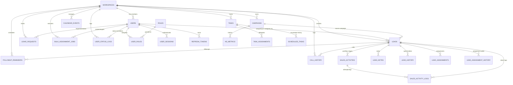

# Hoossh Lead Management — Full Database Schema Documentation
**Database Name**: `leadgrowth`  
**Engine**: MySQL 8.x / InnoDB  
**Charset / Collation**: `utf8mb4 / utf8mb4_0900_ai_ci`  
**Application Framework**: ASP.NET Core (.NET 10 / .NET 8) EF Core & Spring Boot Compatible  

---

## 🏗️ Entity Relationship Diagram



---

## 📑 Summary of Tables (37 Tables)

| # | Table Name | Domain Module | Primary Purpose |
|---|---|---|---|
| 1 | `workspaces` | Core / Multi-Tenancy | Workspace organization container, company details & subscription limits |
| 2 | `users` | Auth & Team | User profiles, auth credentials, availability, manual status overrides & capacity |
| 3 | `roles` | RBAC | Role definitions (`ROLE_ADMIN`, `ROLE_MANAGER`, `ROLE_USER`) |
| 4 | `user_roles` | RBAC | User-to-Role many-to-many junction table |
| 5 | `workspace_invites` | Team Management | Member invitation tokens, role assignments & statuses |
| 6 | `user_sessions` | Security & Auth | Active user sessions, login timestamps & device IP/agent footprints |
| 7 | `refresh_tokens` | Security & Auth | Long-lived JWT refresh tokens for session renewal |
| 8 | `password_reset_tokens` | Security & Auth | Password recovery reset tokens & expiration |
| 9 | `email_verification_tokens` | Security & Auth | User email confirmation tokens & expiration |
| 10 | `leave_requests` | Workforce Management | Executive leave requests, approval workflow & coverage tracking |
| 11 | `bulk_assignment_jobs` | Assignment Engine | Automated/Manual bulk lead distribution jobs & scheduled execution |
| 12 | `user_status_logs` | Executive Presence | Audit history for availability and manual status changes (Break, Meeting, etc.) |
| 13 | `leads` | Lead Management | Core lead repository, AI scores, queue status, pipeline stages & proposals |
| 14 | `sales_activities` | Enterprise Pipeline | 8-Stage Multi-Activity Workflow stages per lead |
| 15 | `sales_activity_logs` | Enterprise Pipeline | Detailed communication logs, outcomes & attachments per activity stage |
| 16 | `lead_notes` | Lead Notes | Collaborative sales notes and timestamped comments per lead |
| 17 | `lead_history` | Lead Audit | Status transitions, assignees, and audit history timeline |
| 18 | `lead_assignments` | Assignment Engine | Active lead-to-user assignment tracking |
| 19 | `lead_assignment_history` | Assignment Engine | Historical audit of lead reassignment actions and reasons |
| 20 | `assignment_logs` | Assignment Engine | Hybrid auto-assignment and routing strategy audit logs |
| 21 | `lead_activities` | Legacy Pipeline | Backward-compatible activity log store |
| 22 | `campaigns` | Marketing & Ads | Marketing campaigns, budget, ad spends, conversion aggregates & ROAS |
| 23 | `ad_metrics` | Marketing & Ads | Daily ad performance metrics (Impressions, Clicks, Spend, Conversions) |
| 24 | `call_history` | Calls & Tracking | Live call timer sessions, duration, outcomes, recordings & call notes |
| 25 | `followup_reminders` | Follow-ups | Scheduled follow-up reminders, conflict detection & completion remarks |
| 26 | `calendar_events` | Scheduler | Meetings, client demos, appointments & event reminders |
| 27 | `tasks` | Tasks & Operations | Assigned tasks, priorities, due dates, reminder intervals & reschedule counts |
| 28 | `task_assignments` | Tasks & Operations | Task distribution records between users |
| 29 | `scheduled_tasks` | Task Operations | Task reschedule history, previous due dates, new dates & reasons |
| 30 | `user_productivity` | Analytics | Daily user productivity metrics (tasks completed, calls made, conversions, score) |
| 31 | `notifications` | Notifications | User in-app notifications, alerts and read/unread status |
| 32 | `audit_logs` | Compliance | System-wide administrative action logs, IP tracking & security audits |
| 33 | `activity_logs` | System Logs | Operational workspace activity stream |
| 34 | `integrations` | Integrations | Third-party providers (Google Ads, Meta, Webhooks) connection configurations |
| 35 | `sync_logs` | Integrations | Data synchronization run histories, status & error traces |
| 36 | `reports` | Reports & Analytics | Report requests, date ranges, types & managerial review comments |
| 37 | `report_history` | Reports & Export | Export history, file formats (CSV/PDF), download URLs & record counts |

---

# 🛠️ Detailed Table Schemas

---

### 1. `workspaces`
```sql
CREATE TABLE `workspaces` (
  `id` bigint NOT NULL AUTO_INCREMENT,
  `name` varchar(100) NOT NULL,
  `company_name` varchar(100) DEFAULT NULL,
  `industry` varchar(50) DEFAULT NULL,
  `team_size` int DEFAULT NULL,
  `website` varchar(100) DEFAULT NULL,
  `timezone` varchar(50) DEFAULT NULL,
  `invite_code` varchar(50) NOT NULL,
  `slug` varchar(100) NOT NULL,
  `subscription_plan` varchar(30) NOT NULL DEFAULT 'PROFESSIONAL',
  `max_users` int NOT NULL DEFAULT 25,
  `max_leads` int NOT NULL DEFAULT 10000,
  `max_storage_mb` int NOT NULL DEFAULT 5000,
  `created_at` datetime(6) NOT NULL,
  PRIMARY KEY (`id`),
  UNIQUE KEY `UK_workspaces_slug` (`slug`),
  UNIQUE KEY `UK_workspaces_invite_code` (`invite_code`)
) ENGINE=InnoDB DEFAULT CHARSET=utf8mb4 COLLATE=utf8mb4_0900_ai_ci;
```

---

### 2. `users`
```sql
CREATE TABLE `users` (
  `id` bigint NOT NULL AUTO_INCREMENT,
  `email` varchar(100) NOT NULL,
  `password` varchar(255) NOT NULL,
  `full_name` varchar(100) NOT NULL,
  `designation` varchar(100) DEFAULT NULL,
  `bio` text,
  `profile_image` longtext,
  `phone` varchar(20) DEFAULT NULL,
  `status` varchar(20) NOT NULL DEFAULT 'ACTIVE',               -- ACTIVE, INACTIVE, SUSPENDED
  `workspace_id` bigint DEFAULT NULL,
  `department` varchar(100) DEFAULT NULL,
  `last_active_at` datetime(6) DEFAULT NULL,
  `availability_status` varchar(20) NOT NULL DEFAULT 'AVAILABLE', -- AVAILABLE, BUSY, OFFLINE, ON_BREAK, ON_LEAVE
  `last_assigned_at` datetime(6) DEFAULT NULL,
  `is_email_verified` bit(1) NOT NULL DEFAULT 0,
  `can_receive_leads` bit(1) NOT NULL DEFAULT 1,
  `last_heartbeat_at` datetime(6) DEFAULT NULL,
  `manual_status` varchar(20) DEFAULT NULL,                      -- AVAILABLE, BUSY, ON_BREAK, ON_LEAVE, DO_NOT_DISTURB
  `manual_status_source` varchar(20) DEFAULT NULL,               -- SYSTEM, USER, ADMIN
  `manual_status_reason` varchar(255) DEFAULT NULL,
  `manual_status_expires_at` datetime(6) DEFAULT NULL,
  `max_capacity` int DEFAULT 30,
  `created_at` datetime(6) NOT NULL,
  PRIMARY KEY (`id`),
  UNIQUE KEY `UK_users_email` (`email`),
  KEY `FK_users_workspace` (`workspace_id`),
  CONSTRAINT `FK_users_workspace` FOREIGN KEY (`workspace_id`) REFERENCES `workspaces` (`id`)
) ENGINE=InnoDB DEFAULT CHARSET=utf8mb4 COLLATE=utf8mb4_0900_ai_ci;
```

---

### 3. `roles` & 4. `user_roles`
```sql
CREATE TABLE `roles` (
  `id` bigint NOT NULL AUTO_INCREMENT,
  `name` varchar(50) NOT NULL,
  PRIMARY KEY (`id`),
  UNIQUE KEY `UK_roles_name` (`name`)
) ENGINE=InnoDB DEFAULT CHARSET=utf8mb4 COLLATE=utf8mb4_0900_ai_ci;

CREATE TABLE `user_roles` (
  `user_id` bigint NOT NULL,
  `role_id` bigint NOT NULL,
  PRIMARY KEY (`user_id`, `role_id`),
  KEY `FK_user_roles_role` (`role_id`),
  CONSTRAINT `FK_user_roles_user` FOREIGN KEY (`user_id`) REFERENCES `users` (`id`) ON DELETE CASCADE,
  CONSTRAINT `FK_user_roles_role` FOREIGN KEY (`role_id`) REFERENCES `roles` (`id`) ON DELETE CASCADE
) ENGINE=InnoDB DEFAULT CHARSET=utf8mb4 COLLATE=utf8mb4_0900_ai_ci;
```

---

### 5. `workspace_invites`
```sql
CREATE TABLE `workspace_invites` (
  `id` bigint NOT NULL AUTO_INCREMENT,
  `email` varchar(100) NOT NULL,
  `role` varchar(50) NOT NULL DEFAULT 'USER',
  `token` varchar(100) NOT NULL,
  `workspace_id` bigint NOT NULL,
  `status` varchar(20) NOT NULL DEFAULT 'PENDING',
  `expiry_date` datetime(6) DEFAULT NULL,
  `expires_at` datetime(6) DEFAULT NULL,
  `invited_by_id` bigint DEFAULT NULL,
  `created_at` datetime(6) NOT NULL,
  PRIMARY KEY (`id`),
  UNIQUE KEY `UK_invites_token` (`token`),
  KEY `FK_invites_workspace` (`workspace_id`),
  KEY `FK_invites_user` (`invited_by_id`),
  CONSTRAINT `FK_invites_workspace` FOREIGN KEY (`workspace_id`) REFERENCES `workspaces` (`id`),
  CONSTRAINT `FK_invites_user` FOREIGN KEY (`invited_by_id`) REFERENCES `users` (`id`)
) ENGINE=InnoDB DEFAULT CHARSET=utf8mb4 COLLATE=utf8mb4_0900_ai_ci;
```

---

### 6. `user_sessions`
```sql
CREATE TABLE `user_sessions` (
  `id` bigint NOT NULL AUTO_INCREMENT,
  `user_id` bigint NOT NULL,
  `ip_address` varchar(45) DEFAULT NULL,
  `user_agent` varchar(255) DEFAULT NULL,
  `login_time` datetime(6) NOT NULL,
  `last_active_time` datetime(6) NOT NULL,
  `is_expired` bit(1) NOT NULL DEFAULT 0,
  PRIMARY KEY (`id`),
  KEY `FK_sessions_user` (`user_id`),
  CONSTRAINT `FK_sessions_user` FOREIGN KEY (`user_id`) REFERENCES `users` (`id`)
) ENGINE=InnoDB DEFAULT CHARSET=utf8mb4 COLLATE=utf8mb4_0900_ai_ci;
```

---

### 7. `refresh_tokens`, 8. `password_reset_tokens` & 9. `email_verification_tokens`
```sql
CREATE TABLE `refresh_tokens` (
  `id` bigint NOT NULL AUTO_INCREMENT,
  `user_id` bigint NOT NULL,
  `token` varchar(100) NOT NULL,
  `expiry_date` datetime(6) NOT NULL,
  PRIMARY KEY (`id`),
  KEY `FK_refresh_tokens_user` (`user_id`),
  CONSTRAINT `FK_refresh_tokens_user` FOREIGN KEY (`user_id`) REFERENCES `users` (`id`)
) ENGINE=InnoDB DEFAULT CHARSET=utf8mb4 COLLATE=utf8mb4_0900_ai_ci;

CREATE TABLE `password_reset_tokens` (
  `id` bigint NOT NULL AUTO_INCREMENT,
  `user_id` bigint NOT NULL,
  `token` varchar(100) NOT NULL,
  `expiry_date` datetime(6) NOT NULL,
  PRIMARY KEY (`id`),
  KEY `FK_password_reset_user` (`user_id`),
  CONSTRAINT `FK_password_reset_user` FOREIGN KEY (`user_id`) REFERENCES `users` (`id`)
) ENGINE=InnoDB DEFAULT CHARSET=utf8mb4 COLLATE=utf8mb4_0900_ai_ci;

CREATE TABLE `email_verification_tokens` (
  `id` bigint NOT NULL AUTO_INCREMENT,
  `user_id` bigint NOT NULL,
  `token` varchar(100) NOT NULL,
  `expiry_date` datetime(6) NOT NULL,
  PRIMARY KEY (`id`),
  KEY `FK_email_verification_user` (`user_id`),
  CONSTRAINT `FK_email_verification_user` FOREIGN KEY (`user_id`) REFERENCES `users` (`id`)
) ENGINE=InnoDB DEFAULT CHARSET=utf8mb4 COLLATE=utf8mb4_0900_ai_ci;
```

---

### 10. `leave_requests`
```sql
CREATE TABLE `leave_requests` (
  `id` bigint NOT NULL AUTO_INCREMENT,
  `workspace_id` bigint NOT NULL,
  `user_id` bigint NOT NULL,
  `start_at_utc` datetime(6) NOT NULL,
  `end_at_utc` datetime(6) NOT NULL,
  `reason` varchar(255) NOT NULL,
  `status` varchar(20) NOT NULL DEFAULT 'PENDING', -- PENDING, APPROVED, REJECTED, CANCELLED
  `requested_at_utc` datetime(6) NOT NULL,
  `reviewed_at_utc` datetime(6) DEFAULT NULL,
  `reviewed_by_id` bigint DEFAULT NULL,
  `review_note` text,
  PRIMARY KEY (`id`),
  KEY `IX_leave_requests_composite` (`workspace_id`, `user_id`, `status`),
  KEY `FK_leave_requests_user` (`user_id`),
  KEY `FK_leave_requests_reviewer` (`reviewed_by_id`),
  CONSTRAINT `FK_leave_requests_workspace` FOREIGN KEY (`workspace_id`) REFERENCES `workspaces` (`id`),
  CONSTRAINT `FK_leave_requests_user` FOREIGN KEY (`user_id`) REFERENCES `users` (`id`),
  CONSTRAINT `FK_leave_requests_reviewer` FOREIGN KEY (`reviewed_by_id`) REFERENCES `users` (`id`)
) ENGINE=InnoDB DEFAULT CHARSET=utf8mb4 COLLATE=utf8mb4_0900_ai_ci;
```

---

### 11. `bulk_assignment_jobs`
```sql
CREATE TABLE `bulk_assignment_jobs` (
  `id` bigint NOT NULL AUTO_INCREMENT,
  `workspace_id` bigint NOT NULL,
  `created_by_admin_id` bigint NOT NULL,
  `assignment_method` varchar(20) NOT NULL DEFAULT 'AUTO', -- AUTO, MANUAL
  `target_user_id` bigint DEFAULT NULL,
  `lead_ids_json` longtext NOT NULL,
  `scheduled_at_utc` datetime(6) DEFAULT NULL,
  `started_at_utc` datetime(6) DEFAULT NULL,
  `completed_at_utc` datetime(6) DEFAULT NULL,
  `status` varchar(30) NOT NULL DEFAULT 'PENDING',         -- PENDING, RUNNING, COMPLETED, PARTIALLY_COMPLETED, FAILED, CANCELLED
  `total_lead_count` int NOT NULL DEFAULT 0,
  `assigned_count` int NOT NULL DEFAULT 0,
  `unassigned_count` int NOT NULL DEFAULT 0,
  `failure_summary` text,
  `created_at_utc` datetime(6) NOT NULL,
  PRIMARY KEY (`id`),
  KEY `IX_bulk_assignment_status` (`workspace_id`, `status`),
  KEY `FK_bulk_jobs_admin` (`created_by_admin_id`),
  KEY `FK_bulk_jobs_target_user` (`target_user_id`),
  CONSTRAINT `FK_bulk_jobs_workspace` FOREIGN KEY (`workspace_id`) REFERENCES `workspaces` (`id`),
  CONSTRAINT `FK_bulk_jobs_admin` FOREIGN KEY (`created_by_admin_id`) REFERENCES `users` (`id`),
  CONSTRAINT `FK_bulk_jobs_target_user` FOREIGN KEY (`target_user_id`) REFERENCES `users` (`id`)
) ENGINE=InnoDB DEFAULT CHARSET=utf8mb4 COLLATE=utf8mb4_0900_ai_ci;
```

---

### 12. `user_status_logs`
```sql
CREATE TABLE `user_status_logs` (
  `id` bigint NOT NULL AUTO_INCREMENT,
  `workspace_id` bigint NOT NULL,
  `user_id` bigint NOT NULL,
  `previous_status` varchar(20) NOT NULL,
  `new_status` varchar(20) NOT NULL,
  `status_source` varchar(20) NOT NULL DEFAULT 'SYSTEM', -- SYSTEM, USER, ADMIN
  `reason` varchar(255) DEFAULT NULL,
  `changed_by_id` bigint DEFAULT NULL,
  `started_at_utc` datetime(6) DEFAULT NULL,
  `expires_at_utc` datetime(6) DEFAULT NULL,
  `created_at_utc` datetime(6) NOT NULL,
  PRIMARY KEY (`id`),
  KEY `IX_user_status_logs_composite` (`workspace_id`, `user_id`, `created_at_utc`),
  KEY `FK_status_logs_user` (`user_id`),
  KEY `FK_status_logs_changer` (`changed_by_id`),
  CONSTRAINT `FK_status_logs_workspace` FOREIGN KEY (`workspace_id`) REFERENCES `workspaces` (`id`),
  CONSTRAINT `FK_status_logs_user` FOREIGN KEY (`user_id`) REFERENCES `users` (`id`),
  CONSTRAINT `FK_status_logs_changer` FOREIGN KEY (`changed_by_id`) REFERENCES `users` (`id`)
) ENGINE=InnoDB DEFAULT CHARSET=utf8mb4 COLLATE=utf8mb4_0900_ai_ci;
```

---

### 13. `leads`
```sql
CREATE TABLE `leads` (
  `id` bigint NOT NULL AUTO_INCREMENT,
  `workspace_id` bigint NOT NULL,
  `campaign_id` bigint DEFAULT NULL,
  `name` varchar(100) NOT NULL,
  `email` varchar(100) NOT NULL,
  `phone` varchar(20) DEFAULT NULL,
  `source_platform` varchar(50) DEFAULT NULL,
  `campaign_name` varchar(100) DEFAULT NULL,
  `status` varchar(50) DEFAULT NULL,
  `assigned_to_id` bigint DEFAULT NULL,
  `quality_score` int DEFAULT NULL,
  `quality_tier` varchar(20) DEFAULT NULL,
  `conversion_probability` double DEFAULT NULL,
  `queue_status` varchar(30) DEFAULT NULL,
  `company` varchar(100) DEFAULT NULL,
  `location` varchar(100) DEFAULT NULL,
  `priority` varchar(20) DEFAULT 'MEDIUM',
  `assigned_by_id` bigint DEFAULT NULL,
  `assigned_date` datetime(6) DEFAULT NULL,
  `progress_percentage` int DEFAULT 0,
  `last_followup_date` datetime(6) DEFAULT NULL,
  `due_date` datetime(6) DEFAULT NULL,
  `client_notes` text,
  `proposal_amount` double DEFAULT NULL,
  `proposal_status` varchar(30) DEFAULT NULL,
  `created_at` datetime(6) NOT NULL,
  PRIMARY KEY (`id`),
  KEY `FK_leads_workspace` (`workspace_id`),
  KEY `FK_leads_campaign` (`campaign_id`),
  KEY `FK_leads_assigned_to` (`assigned_to_id`),
  KEY `FK_leads_assigned_by` (`assigned_by_id`),
  CONSTRAINT `FK_leads_workspace` FOREIGN KEY (`workspace_id`) REFERENCES `workspaces` (`id`),
  CONSTRAINT `FK_leads_campaign` FOREIGN KEY (`campaign_id`) REFERENCES `campaigns` (`id`),
  CONSTRAINT `FK_leads_assigned_to` FOREIGN KEY (`assigned_to_id`) REFERENCES `users` (`id`),
  CONSTRAINT `FK_leads_assigned_by` FOREIGN KEY (`assigned_by_id`) REFERENCES `users` (`id`)
) ENGINE=InnoDB DEFAULT CHARSET=utf8mb4 COLLATE=utf8mb4_0900_ai_ci;
```

---

### 14. `sales_activities`
```sql
CREATE TABLE `sales_activities` (
  `id` bigint NOT NULL AUTO_INCREMENT,
  `lead_id` bigint NOT NULL,
  `activity_key` varchar(50) NOT NULL,
  `title` varchar(100) NOT NULL,
  `status` varchar(20) NOT NULL DEFAULT 'PENDING',
  `completed_at` datetime(6) DEFAULT NULL,
  `completed_by_id` bigint DEFAULT NULL,
  `completion_remarks` text,
  `remarks` text,
  `created_at` datetime(6) DEFAULT NULL,
  PRIMARY KEY (`id`),
  KEY `FK_sales_activities_lead` (`lead_id`),
  KEY `FK_sales_activities_user` (`completed_by_id`),
  CONSTRAINT `FK_sales_activities_lead` FOREIGN KEY (`lead_id`) REFERENCES `leads` (`id`),
  CONSTRAINT `FK_sales_activities_user` FOREIGN KEY (`completed_by_id`) REFERENCES `users` (`id`)
) ENGINE=InnoDB DEFAULT CHARSET=utf8mb4 COLLATE=utf8mb4_0900_ai_ci;
```

---

### 15. `sales_activity_logs`
```sql
CREATE TABLE `sales_activity_logs` (
  `id` bigint NOT NULL AUTO_INCREMENT,
  `sales_activity_id` bigint DEFAULT NULL,
  `lead_id` bigint NOT NULL,
  `activity_number` int NOT NULL DEFAULT 1,
  `communication_type` varchar(50) NOT NULL DEFAULT 'PHONE_CALL',
  `outcome` varchar(50) NOT NULL DEFAULT 'BUSY',
  `remarks` text,
  `duration` varchar(30) DEFAULT NULL,
  `status` varchar(30) NOT NULL DEFAULT 'ATTEMPTED',
  `next_followup_date` datetime(6) DEFAULT NULL,
  `attachments` text,
  `logged_by_id` bigint DEFAULT NULL,
  `created_at` datetime(6) DEFAULT NULL,
  PRIMARY KEY (`id`),
  KEY `FK_sales_activity_logs_activity` (`sales_activity_id`),
  KEY `FK_sales_activity_logs_lead` (`lead_id`),
  KEY `FK_sales_activity_logs_user` (`logged_by_id`),
  CONSTRAINT `FK_sales_activity_logs_activity` FOREIGN KEY (`sales_activity_id`) REFERENCES `sales_activities` (`id`),
  CONSTRAINT `FK_sales_activity_logs_lead` FOREIGN KEY (`lead_id`) REFERENCES `leads` (`id`),
  CONSTRAINT `FK_sales_activity_logs_user` FOREIGN KEY (`logged_by_id`) REFERENCES `users` (`id`)
) ENGINE=InnoDB DEFAULT CHARSET=utf8mb4 COLLATE=utf8mb4_0900_ai_ci;
```

---

### 16. `lead_notes`
```sql
CREATE TABLE `lead_notes` (
  `id` bigint NOT NULL AUTO_INCREMENT,
  `lead_id` bigint NOT NULL,
  `user_id` bigint NOT NULL,
  `note` text NOT NULL,
  `created_at` datetime(6) NOT NULL,
  PRIMARY KEY (`id`),
  KEY `FK_lead_notes_lead` (`lead_id`),
  KEY `FK_lead_notes_user` (`user_id`),
  CONSTRAINT `FK_lead_notes_lead` FOREIGN KEY (`lead_id`) REFERENCES `leads` (`id`),
  CONSTRAINT `FK_lead_notes_user` FOREIGN KEY (`user_id`) REFERENCES `users` (`id`)
) ENGINE=InnoDB DEFAULT CHARSET=utf8mb4 COLLATE=utf8mb4_0900_ai_ci;
```

---

### 17. `lead_history`
```sql
CREATE TABLE `lead_history` (
  `id` bigint NOT NULL AUTO_INCREMENT,
  `lead_id` bigint NOT NULL,
  `action` varchar(100) NOT NULL,
  `description` text,
  `performed_by_id` bigint DEFAULT NULL,
  `previous_status` varchar(50) DEFAULT NULL,
  `new_status` varchar(50) DEFAULT NULL,
  `timestamp` datetime(6) DEFAULT NULL,
  PRIMARY KEY (`id`),
  KEY `FK_lead_history_lead` (`lead_id`),
  KEY `FK_lead_history_user` (`performed_by_id`),
  CONSTRAINT `FK_lead_history_lead` FOREIGN KEY (`lead_id`) REFERENCES `leads` (`id`),
  CONSTRAINT `FK_lead_history_user` FOREIGN KEY (`performed_by_id`) REFERENCES `users` (`id`)
) ENGINE=InnoDB DEFAULT CHARSET=utf8mb4 COLLATE=utf8mb4_0900_ai_ci;
```

---

### 18. `lead_assignments`, 19. `lead_assignment_history` & 20. `assignment_logs`
```sql
CREATE TABLE `lead_assignments` (
  `id` bigint NOT NULL AUTO_INCREMENT,
  `lead_id` bigint NOT NULL,
  `user_id` bigint NOT NULL,
  `assigned_at` datetime(6) NOT NULL,
  PRIMARY KEY (`id`),
  KEY `FK_lead_assignments_lead` (`lead_id`),
  KEY `FK_lead_assignments_user` (`user_id`),
  CONSTRAINT `FK_lead_assignments_lead` FOREIGN KEY (`lead_id`) REFERENCES `leads` (`id`),
  CONSTRAINT `FK_lead_assignments_user` FOREIGN KEY (`user_id`) REFERENCES `users` (`id`)
) ENGINE=InnoDB DEFAULT CHARSET=utf8mb4 COLLATE=utf8mb4_0900_ai_ci;

CREATE TABLE `lead_assignment_history` (
  `id` bigint NOT NULL AUTO_INCREMENT,
  `lead_id` bigint NOT NULL,
  `assigned_by_id` bigint DEFAULT NULL,
  `assigned_to_id` bigint DEFAULT NULL,
  `reason` text,
  `assigned_at` datetime(6) NOT NULL,
  PRIMARY KEY (`id`),
  KEY `FK_assignment_history_lead` (`lead_id`),
  KEY `FK_assignment_history_assigner` (`assigned_by_id`),
  KEY `FK_assignment_history_assignee` (`assigned_to_id`),
  CONSTRAINT `FK_assignment_history_lead` FOREIGN KEY (`lead_id`) REFERENCES `leads` (`id`),
  CONSTRAINT `FK_assignment_history_assigner` FOREIGN KEY (`assigned_by_id`) REFERENCES `users` (`id`),
  CONSTRAINT `FK_assignment_history_assignee` FOREIGN KEY (`assigned_to_id`) REFERENCES `users` (`id`)
) ENGINE=InnoDB DEFAULT CHARSET=utf8mb4 COLLATE=utf8mb4_0900_ai_ci;

CREATE TABLE `assignment_logs` (
  `id` bigint NOT NULL AUTO_INCREMENT,
  `workspace_id` bigint NOT NULL,
  `lead_id` bigint NOT NULL,
  `user_id` bigint NOT NULL,
  `strategy` varchar(50) DEFAULT NULL,
  `assigned_at` datetime(6) NOT NULL,
  PRIMARY KEY (`id`),
  KEY `FK_assignment_logs_workspace` (`workspace_id`),
  KEY `FK_assignment_logs_lead` (`lead_id`),
  KEY `FK_assignment_logs_user` (`user_id`),
  CONSTRAINT `FK_assignment_logs_workspace` FOREIGN KEY (`workspace_id`) REFERENCES `workspaces` (`id`),
  CONSTRAINT `FK_assignment_logs_lead` FOREIGN KEY (`lead_id`) REFERENCES `leads` (`id`),
  CONSTRAINT `FK_assignment_logs_user` FOREIGN KEY (`user_id`) REFERENCES `users` (`id`)
) ENGINE=InnoDB DEFAULT CHARSET=utf8mb4 COLLATE=utf8mb4_0900_ai_ci;
```

---

### 21. `lead_activities` (Legacy Support)
```sql
CREATE TABLE `lead_activities` (
  `id` bigint NOT NULL AUTO_INCREMENT,
  `lead_id` bigint NOT NULL,
  `activity_key` varchar(100) NOT NULL,
  `status` varchar(50) NOT NULL DEFAULT 'PENDING',
  `remarks` text,
  `completed_at` datetime(6) DEFAULT NULL,
  `created_at` datetime(6) NOT NULL,
  PRIMARY KEY (`id`),
  KEY `FK_lead_activities_lead` (`lead_id`),
  CONSTRAINT `FK_lead_activities_lead` FOREIGN KEY (`lead_id`) REFERENCES `leads` (`id`)
) ENGINE=InnoDB DEFAULT CHARSET=utf8mb4 COLLATE=utf8mb4_0900_ai_ci;
```

---

### 22. `campaigns`
```sql
CREATE TABLE `campaigns` (
  `id` bigint NOT NULL AUTO_INCREMENT,
  `workspace_id` bigint NOT NULL,
  `name` varchar(100) NOT NULL,
  `platform` varchar(50) NOT NULL,
  `status` varchar(50) DEFAULT NULL,
  `budget` decimal(12,2) NOT NULL DEFAULT '0.00',
  `spend` decimal(12,2) NOT NULL DEFAULT '0.00',
  `clicks` int NOT NULL DEFAULT 0,
  `impressions` int NOT NULL DEFAULT 0,
  `leads_count` int NOT NULL DEFAULT 0,
  `conversions` int NOT NULL DEFAULT 0,
  `revenue` decimal(12,2) NOT NULL DEFAULT '0.00',
  `created_at` datetime(6) NOT NULL,
  PRIMARY KEY (`id`),
  KEY `FK_campaigns_workspace` (`workspace_id`),
  CONSTRAINT `FK_campaigns_workspace` FOREIGN KEY (`workspace_id`) REFERENCES `workspaces` (`id`)
) ENGINE=InnoDB DEFAULT CHARSET=utf8mb4 COLLATE=utf8mb4_0900_ai_ci;
```

---

### 23. `ad_metrics`
```sql
CREATE TABLE `ad_metrics` (
  `id` bigint NOT NULL AUTO_INCREMENT,
  `workspace_id` bigint NOT NULL,
  `campaign_id` bigint DEFAULT NULL,
  `platform` varchar(50) NOT NULL,
  `spend` decimal(12,2) NOT NULL DEFAULT '0.00',
  `clicks` int NOT NULL DEFAULT 0,
  `impressions` int NOT NULL DEFAULT 0,
  `conversions` int NOT NULL DEFAULT 0,
  `date` date NOT NULL,
  PRIMARY KEY (`id`),
  KEY `FK_ad_metrics_workspace` (`workspace_id`),
  KEY `FK_ad_metrics_campaign` (`campaign_id`),
  CONSTRAINT `FK_ad_metrics_workspace` FOREIGN KEY (`workspace_id`) REFERENCES `workspaces` (`id`),
  CONSTRAINT `FK_ad_metrics_campaign` FOREIGN KEY (`campaign_id`) REFERENCES `campaigns` (`id`)
) ENGINE=InnoDB DEFAULT CHARSET=utf8mb4 COLLATE=utf8mb4_0900_ai_ci;
```

---

### 24. `call_history`
```sql
CREATE TABLE `call_history` (
  `id` bigint NOT NULL AUTO_INCREMENT,
  `workspace_id` bigint NOT NULL,
  `lead_id` bigint NOT NULL,
  `user_id` bigint NOT NULL,
  `start_time` datetime(6) NOT NULL,
  `end_time` datetime(6) DEFAULT NULL,
  `duration_seconds` bigint DEFAULT 0,
  `duration_minutes` double DEFAULT 0.0,
  `formatted_duration` varchar(50) DEFAULT NULL,
  `status` varchar(30) NOT NULL DEFAULT 'ACTIVE',
  `notes` text,
  `created_at` datetime(6) DEFAULT NULL,
  `updated_at` datetime(6) DEFAULT NULL,
  PRIMARY KEY (`id`),
  KEY `FK_call_history_workspace` (`workspace_id`),
  KEY `FK_call_history_lead` (`lead_id`),
  KEY `FK_call_history_user` (`user_id`),
  CONSTRAINT `FK_call_history_workspace` FOREIGN KEY (`workspace_id`) REFERENCES `workspaces` (`id`),
  CONSTRAINT `FK_call_history_lead` FOREIGN KEY (`lead_id`) REFERENCES `leads` (`id`),
  CONSTRAINT `FK_call_history_user` FOREIGN KEY (`user_id`) REFERENCES `users` (`id`)
) ENGINE=InnoDB DEFAULT CHARSET=utf8mb4 COLLATE=utf8mb4_0900_ai_ci;
```

---

### 25. `followup_reminders`
```sql
CREATE TABLE `followup_reminders` (
  `id` bigint NOT NULL AUTO_INCREMENT,
  `workspace_id` bigint NOT NULL,
  `lead_id` bigint NOT NULL,
  `assigned_to_id` bigint DEFAULT NULL,
  `scheduled_at` datetime(6) NOT NULL,
  `type` varchar(30) NOT NULL DEFAULT 'CALL',
  `notes` text,
  `status` varchar(20) NOT NULL DEFAULT 'UPCOMING', -- UPCOMING, COMPLETED, CANCELLED, MISSED
  `outcome` varchar(50) DEFAULT NULL,
  `remarks` text,
  `created_at` datetime(6) NOT NULL,
  PRIMARY KEY (`id`),
  KEY `FK_followup_workspace` (`workspace_id`),
  KEY `FK_followup_lead` (`lead_id`),
  KEY `FK_followup_user` (`assigned_to_id`),
  CONSTRAINT `FK_followup_workspace` FOREIGN KEY (`workspace_id`) REFERENCES `workspaces` (`id`),
  CONSTRAINT `FK_followup_lead` FOREIGN KEY (`lead_id`) REFERENCES `leads` (`id`),
  CONSTRAINT `FK_followup_user` FOREIGN KEY (`assigned_to_id`) REFERENCES `users` (`id`)
) ENGINE=InnoDB DEFAULT CHARSET=utf8mb4 COLLATE=utf8mb4_0900_ai_ci;
```

---

### 26. `calendar_events`
```sql
CREATE TABLE `calendar_events` (
  `id` bigint NOT NULL AUTO_INCREMENT,
  `workspace_id` bigint NOT NULL,
  `lead_id` bigint DEFAULT NULL,
  `assigned_user_id` bigint DEFAULT NULL,
  `title` varchar(150) NOT NULL,
  `description` text,
  `start_time` datetime(6) NOT NULL,
  `end_time` datetime(6) NOT NULL,
  `event_type` varchar(50) NOT NULL DEFAULT 'MEETING',
  `reminder_sent` bit(1) NOT NULL DEFAULT 0,
  `reminder_minutes` int NOT NULL DEFAULT 15,
  `status` varchar(30) NOT NULL DEFAULT 'SCHEDULED',
  `created_at` datetime(6) NOT NULL,
  PRIMARY KEY (`id`),
  KEY `FK_calendar_workspace` (`workspace_id`),
  KEY `FK_calendar_lead` (`lead_id`),
  KEY `FK_calendar_user` (`assigned_user_id`),
  CONSTRAINT `FK_calendar_workspace` FOREIGN KEY (`workspace_id`) REFERENCES `workspaces` (`id`),
  CONSTRAINT `FK_calendar_lead` FOREIGN KEY (`lead_id`) REFERENCES `leads` (`id`),
  CONSTRAINT `FK_calendar_user` FOREIGN KEY (`assigned_user_id`) REFERENCES `users` (`id`)
) ENGINE=InnoDB DEFAULT CHARSET=utf8mb4 COLLATE=utf8mb4_0900_ai_ci;
```

---

### 27. `tasks` & 28. `task_assignments`
```sql
CREATE TABLE `tasks` (
  `id` bigint NOT NULL AUTO_INCREMENT,
  `workspace_id` bigint NOT NULL,
  `title` varchar(150) NOT NULL,
  `description` text,
  `assigned_to_id` bigint DEFAULT NULL,
  `assigned_by_id` bigint DEFAULT NULL,
  `due_date` date DEFAULT NULL,
  `due_time` varchar(20) DEFAULT NULL,
  `reminder_minutes` int DEFAULT NULL,
  `reschedule_count` int NOT NULL DEFAULT 0,
  `reschedule_notes` text,
  `priority` varchar(20) DEFAULT NULL,
  `status` varchar(20) DEFAULT NULL,
  `assigned_at` datetime(6) DEFAULT NULL,
  `created_at` datetime(6) NOT NULL,
  PRIMARY KEY (`id`),
  KEY `FK_tasks_workspace` (`workspace_id`),
  KEY `FK_tasks_assigned_to` (`assigned_to_id`),
  KEY `FK_tasks_assigned_by` (`assigned_by_id`),
  CONSTRAINT `FK_tasks_workspace` FOREIGN KEY (`workspace_id`) REFERENCES `workspaces` (`id`),
  CONSTRAINT `FK_tasks_assigned_to` FOREIGN KEY (`assigned_to_id`) REFERENCES `users` (`id`),
  CONSTRAINT `FK_tasks_assigned_by` FOREIGN KEY (`assigned_by_id`) REFERENCES `users` (`id`)
) ENGINE=InnoDB DEFAULT CHARSET=utf8mb4 COLLATE=utf8mb4_0900_ai_ci;

CREATE TABLE `task_assignments` (
  `id` bigint NOT NULL AUTO_INCREMENT,
  `task_id` bigint NOT NULL,
  `user_id` bigint NOT NULL,
  `assigned_at` datetime(6) NOT NULL,
  PRIMARY KEY (`id`),
  KEY `FK_task_assign_task` (`task_id`),
  KEY `FK_task_assign_user` (`user_id`),
  CONSTRAINT `FK_task_assign_task` FOREIGN KEY (`task_id`) REFERENCES `tasks` (`id`),
  CONSTRAINT `FK_task_assign_user` FOREIGN KEY (`user_id`) REFERENCES `users` (`id`)
) ENGINE=InnoDB DEFAULT CHARSET=utf8mb4 COLLATE=utf8mb4_0900_ai_ci;
```

---

### 29. `scheduled_tasks` (Task Reschedule History)
```sql
CREATE TABLE `scheduled_tasks` (
  `id` bigint NOT NULL AUTO_INCREMENT,
  `task_id` bigint NOT NULL,
  `rescheduled_by_id` bigint DEFAULT NULL,
  `old_due_date` date DEFAULT NULL,
  `new_due_date` date DEFAULT NULL,
  `reason` text,
  `rescheduled_at` datetime(6) NOT NULL,
  PRIMARY KEY (`id`),
  KEY `FK_scheduled_tasks_task` (`task_id`),
  KEY `FK_scheduled_tasks_rescheduler` (`rescheduled_by_id`),
  CONSTRAINT `FK_scheduled_tasks_task` FOREIGN KEY (`task_id`) REFERENCES `tasks` (`id`),
  CONSTRAINT `FK_scheduled_tasks_rescheduler` FOREIGN KEY (`rescheduled_by_id`) REFERENCES `users` (`id`)
) ENGINE=InnoDB DEFAULT CHARSET=utf8mb4 COLLATE=utf8mb4_0900_ai_ci;
```

---

### 30. `user_productivity`
```sql
CREATE TABLE `user_productivity` (
  `id` bigint NOT NULL AUTO_INCREMENT,
  `workspace_id` bigint NOT NULL,
  `user_id` bigint NOT NULL,
  `date` date NOT NULL,
  `tasks_completed` int NOT NULL DEFAULT 0,
  `calls_made` int NOT NULL DEFAULT 0,
  `leads_converted` int NOT NULL DEFAULT 0,
  `score` int NOT NULL DEFAULT 0,
  PRIMARY KEY (`id`),
  KEY `FK_user_prod_workspace` (`workspace_id`),
  KEY `FK_user_prod_user` (`user_id`),
  CONSTRAINT `FK_user_prod_workspace` FOREIGN KEY (`workspace_id`) REFERENCES `workspaces` (`id`),
  CONSTRAINT `FK_user_prod_user` FOREIGN KEY (`user_id`) REFERENCES `users` (`id`)
) ENGINE=InnoDB DEFAULT CHARSET=utf8mb4 COLLATE=utf8mb4_0900_ai_ci;
```

---

### 31. `notifications`
```sql
CREATE TABLE `notifications` (
  `id` bigint NOT NULL AUTO_INCREMENT,
  `user_id` bigint NOT NULL,
  `title` varchar(150) NOT NULL,
  `message` text NOT NULL,
  `is_read` bit(1) NOT NULL DEFAULT 0,
  `created_at` datetime(6) NOT NULL,
  PRIMARY KEY (`id`),
  KEY `FK_notif_user` (`user_id`),
  CONSTRAINT `FK_notif_user` FOREIGN KEY (`user_id`) REFERENCES `users` (`id`)
) ENGINE=InnoDB DEFAULT CHARSET=utf8mb4 COLLATE=utf8mb4_0900_ai_ci;
```

---

### 32. `audit_logs` & 33. `activity_logs`
```sql
CREATE TABLE `audit_logs` (
  `id` bigint NOT NULL AUTO_INCREMENT,
  `workspace_id` bigint NOT NULL,
  `user_id` bigint DEFAULT NULL,
  `action` varchar(100) NOT NULL,
  `target_type` varchar(50) DEFAULT NULL,
  `target_id` bigint DEFAULT NULL,
  `ip_address` varchar(50) DEFAULT NULL,
  `description` text,
  `created_at` datetime(6) NOT NULL,
  PRIMARY KEY (`id`),
  KEY `FK_audit_workspace` (`workspace_id`),
  KEY `FK_audit_user` (`user_id`),
  CONSTRAINT `FK_audit_workspace` FOREIGN KEY (`workspace_id`) REFERENCES `workspaces` (`id`),
  CONSTRAINT `FK_audit_user` FOREIGN KEY (`user_id`) REFERENCES `users` (`id`)
) ENGINE=InnoDB DEFAULT CHARSET=utf8mb4 COLLATE=utf8mb4_0900_ai_ci;

CREATE TABLE `activity_logs` (
  `id` bigint NOT NULL AUTO_INCREMENT,
  `workspace_id` bigint NOT NULL,
  `user_id` bigint DEFAULT NULL,
  `action` varchar(100) NOT NULL,
  `description` text,
  `created_at` datetime(6) NOT NULL,
  PRIMARY KEY (`id`),
  KEY `FK_act_workspace` (`workspace_id`),
  KEY `FK_act_user` (`user_id`),
  CONSTRAINT `FK_act_workspace` FOREIGN KEY (`workspace_id`) REFERENCES `workspaces` (`id`),
  CONSTRAINT `FK_act_user` FOREIGN KEY (`user_id`) REFERENCES `users` (`id`)
) ENGINE=InnoDB DEFAULT CHARSET=utf8mb4 COLLATE=utf8mb4_0900_ai_ci;
```

---

### 34. `integrations` & 35. `sync_logs`
```sql
CREATE TABLE `integrations` (
  `id` bigint NOT NULL AUTO_INCREMENT,
  `workspace_id` bigint NOT NULL,
  `platform` varchar(50) NOT NULL,
  `api_key` varchar(255) DEFAULT NULL,
  `status` varchar(30) NOT NULL DEFAULT 'Disconnected',
  `last_synced_at` datetime(6) DEFAULT NULL,
  PRIMARY KEY (`id`),
  KEY `FK_integrations_workspace` (`workspace_id`),
  CONSTRAINT `FK_integrations_workspace` FOREIGN KEY (`workspace_id`) REFERENCES `workspaces` (`id`)
) ENGINE=InnoDB DEFAULT CHARSET=utf8mb4 COLLATE=utf8mb4_0900_ai_ci;

CREATE TABLE `sync_logs` (
  `id` bigint NOT NULL AUTO_INCREMENT,
  `workspace_id` bigint NOT NULL,
  `platform` varchar(50) DEFAULT NULL,
  `status` varchar(20) NOT NULL DEFAULT 'SUCCESS',
  `details` text,
  `created_at` datetime(6) NOT NULL,
  PRIMARY KEY (`id`),
  KEY `FK_sync_workspace` (`workspace_id`),
  CONSTRAINT `FK_sync_workspace` FOREIGN KEY (`workspace_id`) REFERENCES `workspaces` (`id`)
) ENGINE=InnoDB DEFAULT CHARSET=utf8mb4 COLLATE=utf8mb4_0900_ai_ci;
```

---

### 36. `reports` & 37. `report_history`
```sql
CREATE TABLE `reports` (
  `id` bigint NOT NULL AUTO_INCREMENT,
  `workspace_id` bigint NOT NULL,
  `user_id` bigint NOT NULL,
  `report_type` varchar(50) NOT NULL DEFAULT 'DAILY_SALES',
  `period` varchar(50) DEFAULT NULL,
  `start_date` date DEFAULT NULL,
  `end_date` date DEFAULT NULL,
  `status` varchar(30) NOT NULL DEFAULT 'PENDING',
  `reviewed_by_id` bigint DEFAULT NULL,
  `reviewed_at` datetime(6) DEFAULT NULL,
  `review_comments` text,
  `notes` text,
  `created_at` datetime(6) NOT NULL,
  PRIMARY KEY (`id`),
  KEY `FK_reports_workspace` (`workspace_id`),
  KEY `FK_reports_user` (`user_id`),
  KEY `FK_reports_reviewer` (`reviewed_by_id`),
  CONSTRAINT `FK_reports_workspace` FOREIGN KEY (`workspace_id`) REFERENCES `workspaces` (`id`),
  CONSTRAINT `FK_reports_user` FOREIGN KEY (`user_id`) REFERENCES `users` (`id`),
  CONSTRAINT `FK_reports_reviewer` FOREIGN KEY (`reviewed_by_id`) REFERENCES `users` (`id`)
) ENGINE=InnoDB DEFAULT CHARSET=utf8mb4 COLLATE=utf8mb4_0900_ai_ci;

CREATE TABLE `report_history` (
  `id` bigint NOT NULL AUTO_INCREMENT,
  `workspace_id` bigint NOT NULL,
  `user_id` bigint NOT NULL,
  `period` varchar(50) DEFAULT NULL,
  `start_date` date DEFAULT NULL,
  `end_date` date DEFAULT NULL,
  `export_format` varchar(20) NOT NULL DEFAULT 'CSV',
  `report_type` varchar(50) NOT NULL DEFAULT 'SUMMARY',
  `file_name` varchar(150) DEFAULT NULL,
  `records_exported` text,
  `exported_at` datetime(6) NOT NULL,
  PRIMARY KEY (`id`),
  KEY `FK_report_history_workspace` (`workspace_id`),
  KEY `FK_report_history_user` (`user_id`),
  CONSTRAINT `FK_report_history_workspace` FOREIGN KEY (`workspace_id`) REFERENCES `workspaces` (`id`),
  CONSTRAINT `FK_report_history_user` FOREIGN KEY (`user_id`) REFERENCES `users` (`id`)
) ENGINE=InnoDB DEFAULT CHARSET=utf8mb4 COLLATE=utf8mb4_0900_ai_ci;
```
