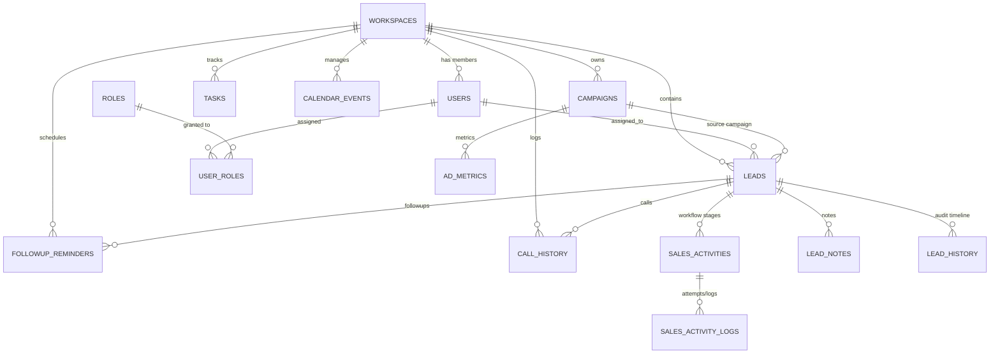

# Hoossh Lead Management — Full Database Schema Documentation
**Database Name**: `leadgrowth`  
**Engine**: MySQL 8.x / InnoDB  
**Charset / Collation**: `utf8mb4 / utf8mb4_0900_ai_ci`  
**Application Framework**: ASP.NET Core (.NET 8) EF Core & Spring Boot Compatible  

---

## 🏗️ Entity Relationship Diagram



---

## 📑 Summary of Tables (34 Tables)

| # | Table Name | Domain Module | Primary Purpose |
|---|---|---|---|
| 1 | `workspaces` | Core / Multi-Tenancy | Workspace organization container & subscription limits |
| 2 | `users` | Auth & Team | User profiles, auth credentials, and assignment states |
| 3 | `roles` | RBAC | Role definitions (`ROLE_ADMIN`, `ROLE_MANAGER`, `ROLE_USER`) |
| 4 | `user_roles` | RBAC | User to Role mapping junction |
| 5 | `workspace_invites` | Team Management | Member invitation tokens & statuses |
| 6 | `user_sessions` | Security & Auth | Active user sessions & device footprints |
| 7 | `refresh_tokens` | Security & Auth | Long-lived JWT refresh tokens |
| 8 | `password_reset_tokens` | Security & Auth | Forgot password recovery tokens |
| 9 | `email_verification_tokens`| Security & Auth | Email confirmation verification tokens |
| 10 | `leads` | Lead Management | Core lead repository, scoring, pipeline, and proposal values |
| 11 | `sales_activities` | Enterprise Pipeline | 8-Stage Multi-Activity Workflow stage containers |
| 12 | `sales_activity_logs` | Enterprise Pipeline | Unlimited interaction logs per workflow stage |
| 13 | `lead_history` | Lead Audit | Status transitions and change history timeline |
| 14 | `lead_notes` | Lead Notes | Collaborative sales notes per lead |
| 15 | `lead_assignments` | Assignment Engine | Lead routing & assignment statuses |
| 16 | `lead_assignment_history` | Assignment Engine | Historical lead assignment logs |
| 17 | `campaigns` | Marketing & Ads | Marketing campaigns, budgets, and aggregate revenue |
| 18 | `ad_metrics` | Marketing & Ads | Daily ad performance metrics (Impressions, Clicks, ROAS) |
| 19 | `call_history` | Calls & Tracking | Live call timer sessions, durations, and call notes |
| 20 | `followup_reminders` | Follow-ups | Scheduled follow-up reminders and conflict flags |
| 21 | `calendar_events` | Scheduler | Meetings, demos, and calendar scheduling |
| 22 | `tasks` | Tasks & Operations | Assigned tasks, priorities, due dates, and reschedules |
| 23 | `task_assignments` | Tasks & Operations | Task distribution records |
| 24 | `scheduled_tasks` | Scheduler Engine | System background automated scheduled jobs |
| 25 | `user_productivity` | Analytics | Daily user productivity score and conversion benchmarks |
| 26 | `notifications` | Notifications | User alerts, real-time push notices, and unread states |
| 27 | `audit_logs` | Compliance | System-wide administrative action logs |
| 28 | `activity_logs` | System Logs | Operational activity stream |
| 29 | `integrations` | Integrations | Third-party providers (Google Ads, Meta, Webhooks) |
| 30 | `sync_logs` | Integrations | Data synchronization run histories & error traces |
| 31 | `reports` | Reports & Export | Report definitions and template parameters |
| 32 | `report_history` | Reports & Export | Generated export files and document download URLs |
| 33 | `assignment_logs` | Assignment Engine | Legacy assignment routing logs |
| 34 | `lead_activities` | Legacy Pipeline | Backward-compatible activity log store |

---

# 🛠️ Detailed Table Schemas

---

### 1. `workspaces`
```sql
CREATE TABLE `workspaces` (
  `id` bigint NOT NULL AUTO_INCREMENT,
  `name` varchar(100) NOT NULL,
  `company_name` varchar(100) DEFAULT NULL,
  `slug` varchar(100) NOT NULL,
  `invite_code` varchar(50) NOT NULL,
  `industry` varchar(50) DEFAULT NULL,
  `website` varchar(100) DEFAULT NULL,
  `timezone` varchar(50) DEFAULT NULL,
  `team_size` int DEFAULT NULL,
  `subscription_plan` varchar(30) NOT NULL,
  `max_users` int DEFAULT NULL,
  `max_leads` int DEFAULT NULL,
  `max_storage_mb` int DEFAULT NULL,
  `created_at` datetime(6) DEFAULT NULL,
  PRIMARY KEY (`id`),
  UNIQUE KEY `UK_workspaces_slug` (`slug`),
  UNIQUE KEY `UK_workspaces_invite_code` (`invite_code`)
) ENGINE=InnoDB DEFAULT CHARSET=utf8mb4 COLLATE=utf8mb4_0900_ai_ci;
```

---

### 2. `users`
```sql
CREATE TABLE `users` (
  `id` bigint NOT NULL AUTO_INCREMENT,
  `workspace_id` bigint DEFAULT NULL,
  `full_name` varchar(100) NOT NULL,
  `email` varchar(100) NOT NULL,
  `password` varchar(255) NOT NULL,
  `phone` varchar(20) DEFAULT NULL,
  `department` varchar(100) DEFAULT NULL,
  `designation` varchar(100) DEFAULT NULL,
  `bio` text,
  `profile_image` longtext,
  `status` varchar(20) NOT NULL,              -- ACTIVE, INACTIVE, SUSPENDED
  `availability_status` varchar(20) NOT NULL, -- AVAILABLE, BUSY, OFFLINE
  `is_email_verified` bit(1) NOT NULL,
  `last_active_at` datetime(6) DEFAULT NULL,
  `last_assigned_at` datetime(6) DEFAULT NULL,
  `created_at` datetime(6) DEFAULT NULL,
  PRIMARY KEY (`id`),
  UNIQUE KEY `UK_users_email` (`email`),
  KEY `FK_users_workspace` (`workspace_id`),
  CONSTRAINT `FK_users_workspace` FOREIGN KEY (`workspace_id`) REFERENCES `workspaces` (`id`)
) ENGINE=InnoDB DEFAULT CHARSET=utf8mb4 COLLATE=utf8mb4_0900_ai_ci;
```

---

### 3. `roles` & 4. `user_roles`
```sql
CREATE TABLE `roles` (
  `id` bigint NOT NULL AUTO_INCREMENT,
  `name` varchar(50) NOT NULL,
  PRIMARY KEY (`id`),
  UNIQUE KEY `UK_roles_name` (`name`)
) ENGINE=InnoDB DEFAULT CHARSET=utf8mb4 COLLATE=utf8mb4_0900_ai_ci;

CREATE TABLE `user_roles` (
  `user_id` bigint NOT NULL,
  `role_id` bigint NOT NULL,
  PRIMARY KEY (`user_id`,`role_id`),
  KEY `FK_user_roles_role` (`role_id`),
  CONSTRAINT `FK_user_roles_user` FOREIGN KEY (`user_id`) REFERENCES `users` (`id`),
  CONSTRAINT `FK_user_roles_role` FOREIGN KEY (`role_id`) REFERENCES `roles` (`id`)
) ENGINE=InnoDB DEFAULT CHARSET=utf8mb4 COLLATE=utf8mb4_0900_ai_ci;
```

---

### 5. `workspace_invites`
```sql
CREATE TABLE `workspace_invites` (
  `id` bigint NOT NULL AUTO_INCREMENT,
  `workspace_id` bigint NOT NULL,
  `invited_by_id` bigint DEFAULT NULL,
  `email` varchar(100) NOT NULL,
  `role` varchar(50) NOT NULL,
  `token` varchar(100) NOT NULL,
  `status` varchar(20) NOT NULL,
  `expires_at` datetime(6) NOT NULL,
  `created_at` datetime(6) DEFAULT NULL,
  `expiry_date` datetime(6) DEFAULT NULL,
  PRIMARY KEY (`id`),
  UNIQUE KEY `UK_invites_token` (`token`),
  KEY `FK_invites_user` (`invited_by_id`),
  KEY `FK_invites_workspace` (`workspace_id`),
  CONSTRAINT `FK_invites_user` FOREIGN KEY (`invited_by_id`) REFERENCES `users` (`id`),
  CONSTRAINT `FK_invites_workspace` FOREIGN KEY (`workspace_id`) REFERENCES `workspaces` (`id`)
) ENGINE=InnoDB DEFAULT CHARSET=utf8mb4 COLLATE=utf8mb4_0900_ai_ci;
```

---

### 6. `leads`
```sql
CREATE TABLE `leads` (
  `id` bigint NOT NULL AUTO_INCREMENT,
  `workspace_id` bigint NOT NULL,
  `campaign_id` bigint DEFAULT NULL,
  `campaign_name` varchar(150) DEFAULT NULL,
  `name` varchar(100) NOT NULL,
  `email` varchar(100) NOT NULL,
  `phone` varchar(20) DEFAULT NULL,
  `company` varchar(100) DEFAULT NULL,
  `location` varchar(100) DEFAULT NULL,
  `source_platform` varchar(50) DEFAULT NULL,
  `status` varchar(30) NOT NULL,
  `queue_status` varchar(30) DEFAULT NULL,
  `priority` varchar(20) DEFAULT NULL,
  `quality_score` int DEFAULT NULL,
  `quality_tier` varchar(20) DEFAULT NULL,
  `conversion_probability` double DEFAULT NULL,
  `progress_percentage` int DEFAULT '0',
  `proposal_amount` double DEFAULT '0',
  `proposal_status` varchar(30) DEFAULT NULL,
  `client_notes` text,
  `assigned_to_id` bigint DEFAULT NULL,
  `assigned_by_id` bigint DEFAULT NULL,
  `assigned_date` datetime(6) DEFAULT NULL,
  `due_date` datetime(6) DEFAULT NULL,
  `last_followup_date` datetime(6) DEFAULT NULL,
  `created_at` datetime(6) DEFAULT NULL,
  PRIMARY KEY (`id`),
  KEY `FK_leads_campaign` (`campaign_id`),
  KEY `FK_leads_assigned_by` (`assigned_by_id`),
  KEY `FK_leads_assigned_to` (`assigned_to_id`),
  KEY `FK_leads_workspace` (`workspace_id`),
  CONSTRAINT `FK_leads_campaign` FOREIGN KEY (`campaign_id`) REFERENCES `campaigns` (`id`),
  CONSTRAINT `FK_leads_assigned_by` FOREIGN KEY (`assigned_by_id`) REFERENCES `users` (`id`),
  CONSTRAINT `FK_leads_assigned_to` FOREIGN KEY (`assigned_to_id`) REFERENCES `users` (`id`),
  CONSTRAINT `FK_leads_workspace` FOREIGN KEY (`workspace_id`) REFERENCES `workspaces` (`id`)
) ENGINE=InnoDB DEFAULT CHARSET=utf8mb4 COLLATE=utf8mb4_0900_ai_ci;
```

---

### 7. `sales_activities`
```sql
CREATE TABLE `sales_activities` (
  `id` bigint NOT NULL AUTO_INCREMENT,
  `lead_id` bigint NOT NULL,
  `activity_key` varchar(50) NOT NULL,
  `title` varchar(100) NOT NULL,
  `status` varchar(30) NOT NULL,
  `completed_at` datetime(6) DEFAULT NULL,
  `completed_by_id` bigint DEFAULT NULL,
  `completion_remarks` text,
  `remarks` text,
  `created_at` datetime(6) DEFAULT NULL,
  PRIMARY KEY (`id`),
  KEY `FK_sales_activities_lead` (`lead_id`),
  KEY `FK_sales_activities_user` (`completed_by_id`),
  CONSTRAINT `FK_sales_activities_lead` FOREIGN KEY (`lead_id`) REFERENCES `leads` (`id`),
  CONSTRAINT `FK_sales_activities_user` FOREIGN KEY (`completed_by_id`) REFERENCES `users` (`id`)
) ENGINE=InnoDB DEFAULT CHARSET=utf8mb4 COLLATE=utf8mb4_0900_ai_ci;
```

---

### 8. `sales_activity_logs`
```sql
CREATE TABLE `sales_activity_logs` (
  `id` bigint NOT NULL AUTO_INCREMENT,
  `sales_activity_id` bigint NOT NULL,
  `activity_number` int NOT NULL,
  `communication_type` varchar(30) NOT NULL,
  `outcome` varchar(50) NOT NULL,
  `remarks` text NOT NULL,
  `duration` varchar(50) DEFAULT NULL,
  `next_followup_date` datetime(6) DEFAULT NULL,
  `attachments` text,
  `status` varchar(30) DEFAULT NULL,
  `logged_by_id` bigint NOT NULL,
  `created_at` datetime(6) DEFAULT NULL,
  PRIMARY KEY (`id`),
  KEY `FK_sales_activity_logs_activity` (`sales_activity_id`),
  KEY `FK_sales_activity_logs_user` (`logged_by_id`),
  CONSTRAINT `FK_sales_activity_logs_activity` FOREIGN KEY (`sales_activity_id`) REFERENCES `sales_activities` (`id`),
  CONSTRAINT `FK_sales_activity_logs_user` FOREIGN KEY (`logged_by_id`) REFERENCES `users` (`id`)
) ENGINE=InnoDB DEFAULT CHARSET=utf8mb4 COLLATE=utf8mb4_0900_ai_ci;
```

---

### 9. `lead_history`
```sql
CREATE TABLE `lead_history` (
  `id` bigint NOT NULL AUTO_INCREMENT,
  `lead_id` bigint NOT NULL,
  `performed_by_id` bigint DEFAULT NULL,
  `action` varchar(50) NOT NULL,
  `description` text,
  `previous_status` varchar(50) DEFAULT NULL,
  `new_status` varchar(50) DEFAULT NULL,
  `timestamp` datetime(6) NOT NULL,
  PRIMARY KEY (`id`),
  KEY `FK_lead_history_lead` (`lead_id`),
  KEY `FK_lead_history_user` (`performed_by_id`),
  CONSTRAINT `FK_lead_history_lead` FOREIGN KEY (`lead_id`) REFERENCES `leads` (`id`),
  CONSTRAINT `FK_lead_history_user` FOREIGN KEY (`performed_by_id`) REFERENCES `users` (`id`)
) ENGINE=InnoDB DEFAULT CHARSET=utf8mb4 COLLATE=utf8mb4_0900_ai_ci;
```

---

### 10. `lead_notes`
```sql
CREATE TABLE `lead_notes` (
  `id` bigint NOT NULL AUTO_INCREMENT,
  `lead_id` bigint NOT NULL,
  `user_id` bigint NOT NULL,
  `note` text NOT NULL,
  `created_at` datetime(6) DEFAULT NULL,
  PRIMARY KEY (`id`),
  KEY `FK_lead_notes_lead` (`lead_id`),
  KEY `FK_lead_notes_user` (`user_id`),
  CONSTRAINT `FK_lead_notes_lead` FOREIGN KEY (`lead_id`) REFERENCES `leads` (`id`),
  CONSTRAINT `FK_lead_notes_user` FOREIGN KEY (`user_id`) REFERENCES `users` (`id`)
) ENGINE=InnoDB DEFAULT CHARSET=utf8mb4 COLLATE=utf8mb4_0900_ai_ci;
```

---

### 11. `campaigns`
```sql
CREATE TABLE `campaigns` (
  `id` bigint NOT NULL AUTO_INCREMENT,
  `workspace_id` bigint NOT NULL,
  `name` varchar(150) NOT NULL,
  `platform` varchar(50) NOT NULL,
  `status` varchar(30) NOT NULL,
  `budget` double NOT NULL,
  `spent` double NOT NULL DEFAULT '0',
  `revenue` double NOT NULL DEFAULT '0',
  `impressions` bigint NOT NULL DEFAULT '0',
  `clicks` bigint NOT NULL DEFAULT '0',
  `conversions` bigint NOT NULL DEFAULT '0',
  `leads_count` int NOT NULL DEFAULT '0',
  `ctr` double NOT NULL DEFAULT '0',
  `cpc` double NOT NULL DEFAULT '0',
  `cpa` double NOT NULL DEFAULT '0',
  `roas` double NOT NULL DEFAULT '0',
  `start_date` date DEFAULT NULL,
  `end_date` date DEFAULT NULL,
  `target_audience` text,
  `created_at` datetime(6) DEFAULT NULL,
  `updated_at` datetime(6) DEFAULT NULL,
  PRIMARY KEY (`id`),
  KEY `FK_campaigns_workspace` (`workspace_id`),
  CONSTRAINT `FK_campaigns_workspace` FOREIGN KEY (`workspace_id`) REFERENCES `workspaces` (`id`)
) ENGINE=InnoDB DEFAULT CHARSET=utf8mb4 COLLATE=utf8mb4_0900_ai_ci;
```

---

### 12. `ad_metrics`
```sql
CREATE TABLE `ad_metrics` (
  `id` bigint NOT NULL AUTO_INCREMENT,
  `campaign_id` bigint NOT NULL,
  `workspace_id` bigint NOT NULL,
  `record_date` date NOT NULL,
  `spend` double NOT NULL,
  `revenue` double NOT NULL,
  `impressions` bigint NOT NULL,
  `clicks` bigint NOT NULL,
  `conversions` bigint NOT NULL,
  `leads_generated` int NOT NULL,
  `ctr` double NOT NULL,
  `cpc` double NOT NULL,
  `roas` double NOT NULL,
  `created_at` datetime(6) DEFAULT NULL,
  PRIMARY KEY (`id`),
  KEY `FK_ad_metrics_campaign` (`campaign_id`),
  KEY `FK_ad_metrics_workspace` (`workspace_id`),
  CONSTRAINT `FK_ad_metrics_campaign` FOREIGN KEY (`campaign_id`) REFERENCES `campaigns` (`id`),
  CONSTRAINT `FK_ad_metrics_workspace` FOREIGN KEY (`workspace_id`) REFERENCES `workspaces` (`id`)
) ENGINE=InnoDB DEFAULT CHARSET=utf8mb4 COLLATE=utf8mb4_0900_ai_ci;
```

---

### 13. `call_history`
```sql
CREATE TABLE `call_history` (
  `id` bigint NOT NULL AUTO_INCREMENT,
  `workspace_id` bigint NOT NULL,
  `lead_id` bigint NOT NULL,
  `user_id` bigint NOT NULL,
  `start_time` datetime(6) NOT NULL,
  `end_time` datetime(6) DEFAULT NULL,
  `duration_seconds` bigint DEFAULT '0',
  `duration_minutes` double DEFAULT '0',
  `formatted_duration` varchar(50) DEFAULT '00:00:00',
  `status` varchar(30) NOT NULL,
  `notes` text,
  `created_at` datetime(6) DEFAULT NULL,
  `updated_at` datetime(6) DEFAULT NULL,
  PRIMARY KEY (`id`),
  KEY `FK_call_history_workspace` (`workspace_id`),
  KEY `FK_call_history_lead` (`lead_id`),
  KEY `FK_call_history_user` (`user_id`),
  CONSTRAINT `FK_call_history_workspace` FOREIGN KEY (`workspace_id`) REFERENCES `workspaces` (`id`),
  CONSTRAINT `FK_call_history_lead` FOREIGN KEY (`lead_id`) REFERENCES `leads` (`id`),
  CONSTRAINT `FK_call_history_user` FOREIGN KEY (`user_id`) REFERENCES `users` (`id`)
) ENGINE=InnoDB DEFAULT CHARSET=utf8mb4 COLLATE=utf8mb4_0900_ai_ci;
```

---

### 14. `followup_reminders`
```sql
CREATE TABLE `followup_reminders` (
  `id` bigint NOT NULL AUTO_INCREMENT,
  `workspace_id` bigint NOT NULL,
  `lead_id` bigint NOT NULL,
  `assigned_to_id` bigint DEFAULT NULL,
  `scheduled_at` datetime(6) NOT NULL,
  `type` varchar(30) NOT NULL,
  `status` varchar(30) NOT NULL,
  `notes` text,
  `remarks` text,
  `outcome` varchar(50) DEFAULT NULL,
  `conflict_flag` bit(1) NOT NULL DEFAULT 0,
  `created_at` datetime(6) DEFAULT NULL,
  PRIMARY KEY (`id`),
  KEY `FK_followup_workspace` (`workspace_id`),
  KEY `FK_followup_lead` (`lead_id`),
  KEY `FK_followup_user` (`assigned_to_id`),
  CONSTRAINT `FK_followup_workspace` FOREIGN KEY (`workspace_id`) REFERENCES `workspaces` (`id`),
  CONSTRAINT `FK_followup_lead` FOREIGN KEY (`lead_id`) REFERENCES `leads` (`id`),
  CONSTRAINT `FK_followup_user` FOREIGN KEY (`assigned_to_id`) REFERENCES `users` (`id`)
) ENGINE=InnoDB DEFAULT CHARSET=utf8mb4 COLLATE=utf8mb4_0900_ai_ci;
```

---

### 15. `calendar_events`
```sql
CREATE TABLE `calendar_events` (
  `id` bigint NOT NULL AUTO_INCREMENT,
  `workspace_id` bigint NOT NULL,
  `lead_id` bigint DEFAULT NULL,
  `assigned_user_id` bigint DEFAULT NULL,
  `title` varchar(150) NOT NULL,
  `description` text,
  `event_type` varchar(30) NOT NULL,
  `start_time` datetime(6) NOT NULL,
  `end_time` datetime(6) NOT NULL,
  `reminder_minutes` int DEFAULT 15,
  `reminder_sent` bit(1) NOT NULL DEFAULT 0,
  `status` varchar(30) NOT NULL,
  `created_at` datetime(6) DEFAULT NULL,
  PRIMARY KEY (`id`),
  KEY `FK_calendar_workspace` (`workspace_id`),
  KEY `FK_calendar_lead` (`lead_id`),
  KEY `FK_calendar_user` (`assigned_user_id`),
  CONSTRAINT `FK_calendar_workspace` FOREIGN KEY (`workspace_id`) REFERENCES `workspaces` (`id`),
  CONSTRAINT `FK_calendar_lead` FOREIGN KEY (`lead_id`) REFERENCES `leads` (`id`),
  CONSTRAINT `FK_calendar_user` FOREIGN KEY (`assigned_user_id`) REFERENCES `users` (`id`)
) ENGINE=InnoDB DEFAULT CHARSET=utf8mb4 COLLATE=utf8mb4_0900_ai_ci;
```

---

### 16. `tasks` & 17. `task_assignments`
```sql
CREATE TABLE `tasks` (
  `id` bigint NOT NULL AUTO_INCREMENT,
  `workspace_id` bigint NOT NULL,
  `assigned_to_id` bigint DEFAULT NULL,
  `assigned_by_id` bigint DEFAULT NULL,
  `title` varchar(150) NOT NULL,
  `description` text,
  `priority` varchar(20) DEFAULT 'MEDIUM',
  `status` varchar(20) DEFAULT 'PENDING',
  `due_date` date DEFAULT NULL,
  `due_time` varchar(20) DEFAULT NULL,
  `reminder_minutes` int DEFAULT NULL,
  `reschedule_count` int DEFAULT '0',
  `reschedule_notes` text,
  `assigned_at` datetime(6) DEFAULT NULL,
  `created_at` datetime(6) DEFAULT NULL,
  PRIMARY KEY (`id`),
  KEY `FK_tasks_workspace` (`workspace_id`),
  KEY `FK_tasks_assigned_to` (`assigned_to_id`),
  KEY `FK_tasks_assigned_by` (`assigned_by_id`),
  CONSTRAINT `FK_tasks_workspace` FOREIGN KEY (`workspace_id`) REFERENCES `workspaces` (`id`),
  CONSTRAINT `FK_tasks_assigned_to` FOREIGN KEY (`assigned_to_id`) REFERENCES `users` (`id`),
  CONSTRAINT `FK_tasks_assigned_by` FOREIGN KEY (`assigned_by_id`) REFERENCES `users` (`id`)
) ENGINE=InnoDB DEFAULT CHARSET=utf8mb4 COLLATE=utf8mb4_0900_ai_ci;

CREATE TABLE `task_assignments` (
  `id` bigint NOT NULL AUTO_INCREMENT,
  `task_id` bigint NOT NULL,
  `user_id` bigint NOT NULL,
  `assigned_by_id` bigint DEFAULT NULL,
  `assigned_at` datetime(6) NOT NULL,
  `status` varchar(20) NOT NULL,
  `notes` text,
  PRIMARY KEY (`id`),
  KEY `FK_task_assign_task` (`task_id`),
  KEY `FK_task_assign_user` (`user_id`),
  CONSTRAINT `FK_task_assign_task` FOREIGN KEY (`task_id`) REFERENCES `tasks` (`id`),
  CONSTRAINT `FK_task_assign_user` FOREIGN KEY (`user_id`) REFERENCES `users` (`id`)
) ENGINE=InnoDB DEFAULT CHARSET=utf8mb4 COLLATE=utf8mb4_0900_ai_ci;
```

---

### 18. `user_productivity`
```sql
CREATE TABLE `user_productivity` (
  `id` bigint NOT NULL AUTO_INCREMENT,
  `workspace_id` bigint NOT NULL,
  `user_id` bigint NOT NULL,
  `record_date` date NOT NULL,
  `completed_tasks_count` int NOT NULL DEFAULT '0',
  `completed_leads_count` int NOT NULL DEFAULT '0',
  `conversion_rate` double NOT NULL DEFAULT '0',
  `average_response_time` double NOT NULL DEFAULT '0',
  `productivity_score` double NOT NULL DEFAULT '0',
  PRIMARY KEY (`id`),
  KEY `FK_user_prod_workspace` (`workspace_id`),
  KEY `FK_user_prod_user` (`user_id`),
  CONSTRAINT `FK_user_prod_workspace` FOREIGN KEY (`workspace_id`) REFERENCES `workspaces` (`id`),
  CONSTRAINT `FK_user_prod_user` FOREIGN KEY (`user_id`) REFERENCES `users` (`id`)
) ENGINE=InnoDB DEFAULT CHARSET=utf8mb4 COLLATE=utf8mb4_0900_ai_ci;
```

---

### 19. `notifications`
```sql
CREATE TABLE `notifications` (
  `id` bigint NOT NULL AUTO_INCREMENT,
  `workspace_id` bigint NOT NULL,
  `user_id` bigint NOT NULL,
  `title` varchar(150) NOT NULL,
  `message` text NOT NULL,
  `type` varchar(50) NOT NULL,
  `is_read` bit(1) NOT NULL DEFAULT 0,
  `action_url` varchar(255) DEFAULT NULL,
  `created_at` datetime(6) DEFAULT NULL,
  PRIMARY KEY (`id`),
  KEY `FK_notif_workspace` (`workspace_id`),
  KEY `FK_notif_user` (`user_id`),
  CONSTRAINT `FK_notif_workspace` FOREIGN KEY (`workspace_id`) REFERENCES `workspaces` (`id`),
  CONSTRAINT `FK_notif_user` FOREIGN KEY (`user_id`) REFERENCES `users` (`id`)
) ENGINE=InnoDB DEFAULT CHARSET=utf8mb4 COLLATE=utf8mb4_0900_ai_ci;
```

---

### 20. `audit_logs` & 21. `activity_logs`
```sql
CREATE TABLE `audit_logs` (
  `id` bigint NOT NULL AUTO_INCREMENT,
  `workspace_id` bigint NOT NULL,
  `user_id` bigint DEFAULT NULL,
  `action` varchar(100) NOT NULL,
  `entity_type` varchar(50) NOT NULL,
  `entity_id` bigint DEFAULT NULL,
  `details` text,
  `ip_address` varchar(45) DEFAULT NULL,
  `timestamp` datetime(6) NOT NULL,
  PRIMARY KEY (`id`),
  KEY `FK_audit_workspace` (`workspace_id`),
  KEY `FK_audit_user` (`user_id`),
  CONSTRAINT `FK_audit_workspace` FOREIGN KEY (`workspace_id`) REFERENCES `workspaces` (`id`),
  CONSTRAINT `FK_audit_user` FOREIGN KEY (`user_id`) REFERENCES `users` (`id`)
) ENGINE=InnoDB DEFAULT CHARSET=utf8mb4 COLLATE=utf8mb4_0900_ai_ci;

CREATE TABLE `activity_logs` (
  `id` bigint NOT NULL AUTO_INCREMENT,
  `workspace_id` bigint NOT NULL,
  `user_id` bigint DEFAULT NULL,
  `lead_id` bigint DEFAULT NULL,
  `activity_type` varchar(50) NOT NULL,
  `description` text,
  `timestamp` datetime(6) NOT NULL,
  PRIMARY KEY (`id`),
  KEY `FK_act_workspace` (`workspace_id`),
  KEY `FK_act_user` (`user_id`),
  KEY `FK_act_lead` (`lead_id`),
  CONSTRAINT `FK_act_workspace` FOREIGN KEY (`workspace_id`) REFERENCES `workspaces` (`id`),
  CONSTRAINT `FK_act_user` FOREIGN KEY (`user_id`) REFERENCES `users` (`id`),
  CONSTRAINT `FK_act_lead` FOREIGN KEY (`lead_id`) REFERENCES `leads` (`id`)
) ENGINE=InnoDB DEFAULT CHARSET=utf8mb4 COLLATE=utf8mb4_0900_ai_ci;
```

---

### 22. `integrations` & 23. `sync_logs`
```sql
CREATE TABLE `integrations` (
  `id` bigint NOT NULL AUTO_INCREMENT,
  `workspace_id` bigint NOT NULL,
  `provider` varchar(50) NOT NULL,
  `api_key` text,
  `access_token` text,
  `refresh_token` text,
  `account_id` varchar(100) DEFAULT NULL,
  `status` varchar(20) NOT NULL,
  `sync_frequency` varchar(30) DEFAULT 'HOURLY',
  `last_synced_at` datetime(6) DEFAULT NULL,
  `created_at` datetime(6) DEFAULT NULL,
  PRIMARY KEY (`id`),
  KEY `FK_integrations_workspace` (`workspace_id`),
  CONSTRAINT `FK_integrations_workspace` FOREIGN KEY (`workspace_id`) REFERENCES `workspaces` (`id`)
) ENGINE=InnoDB DEFAULT CHARSET=utf8mb4 COLLATE=utf8mb4_0900_ai_ci;

CREATE TABLE `sync_logs` (
  `id` bigint NOT NULL AUTO_INCREMENT,
  `workspace_id` bigint NOT NULL,
  `provider` varchar(50) NOT NULL,
  `status` varchar(20) NOT NULL,
  `records_synced` int NOT NULL DEFAULT '0',
  `error_message` text,
  `synced_at` datetime(6) NOT NULL,
  PRIMARY KEY (`id`),
  KEY `FK_sync_workspace` (`workspace_id`),
  CONSTRAINT `FK_sync_workspace` FOREIGN KEY (`workspace_id`) REFERENCES `workspaces` (`id`)
) ENGINE=InnoDB DEFAULT CHARSET=utf8mb4 COLLATE=utf8mb4_0900_ai_ci;
```

---

### 24. `reports` & 25. `report_history`
```sql
CREATE TABLE `reports` (
  `id` bigint NOT NULL AUTO_INCREMENT,
  `workspace_id` bigint NOT NULL,
  `created_by_id` bigint DEFAULT NULL,
  `title` varchar(150) NOT NULL,
  `report_type` varchar(50) NOT NULL,
  `parameters` text,
  `file_format` varchar(20) DEFAULT 'PDF',
  `created_at` datetime(6) DEFAULT NULL,
  PRIMARY KEY (`id`),
  KEY `FK_reports_workspace` (`workspace_id`),
  KEY `FK_reports_user` (`created_by_id`),
  CONSTRAINT `FK_reports_workspace` FOREIGN KEY (`workspace_id`) REFERENCES `workspaces` (`id`),
  CONSTRAINT `FK_reports_user` FOREIGN KEY (`created_by_id`) REFERENCES `users` (`id`)
) ENGINE=InnoDB DEFAULT CHARSET=utf8mb4 COLLATE=utf8mb4_0900_ai_ci;

CREATE TABLE `report_history` (
  `id` bigint NOT NULL AUTO_INCREMENT,
  `report_id` bigint NOT NULL,
  `generated_by_id` bigint DEFAULT NULL,
  `file_url` varchar(255) DEFAULT NULL,
  `status` varchar(20) NOT NULL,
  `generated_at` datetime(6) NOT NULL,
  PRIMARY KEY (`id`),
  KEY `FK_report_history_report` (`report_id`),
  CONSTRAINT `FK_report_history_report` FOREIGN KEY (`report_id`) REFERENCES `reports` (`id`)
) ENGINE=InnoDB DEFAULT CHARSET=utf8mb4 COLLATE=utf8mb4_0900_ai_ci;
```
