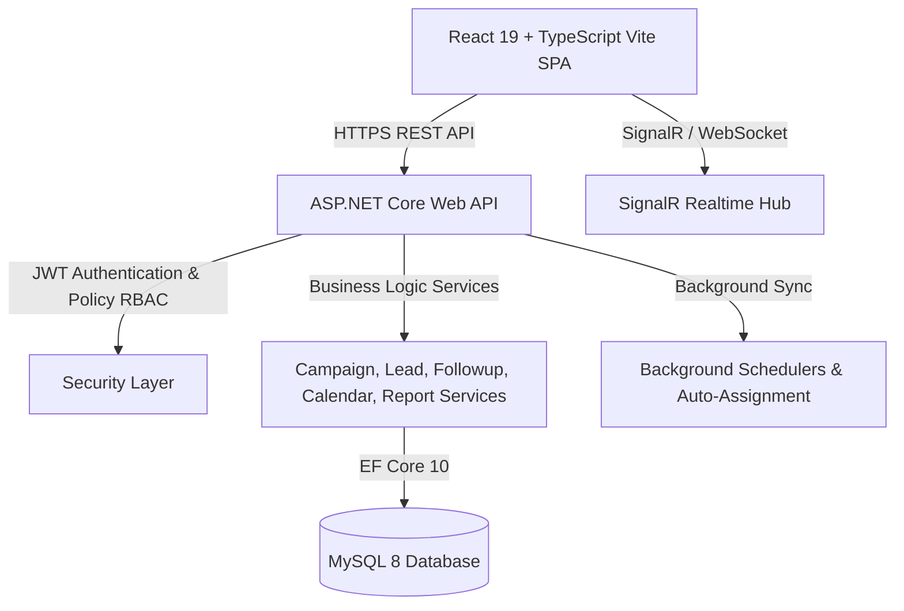

# LeadGrowth — Enterprise Marketing Analytics & Lead Management Platform

> **Tagline:** "One Dashboard. Every Lead. Complete Growth."

**LeadGrowth** is an enterprise-grade SaaS platform and Lead Management System (LMS) built for performance marketing teams, digital agencies, and sales operations. The platform centralizes multi-platform ad campaign analytics, intelligent lead queues, interactive pipelines, follow-up scheduling, executive work monitoring, and multi-format reporting into a unified, high-performance web application.

---

## 📑 Table of Contents

- [Platform Overview](#platform-overview)
- [Key Features & Modules](#key-features--modules)
- [Tech Stack](#tech-stack)
- [System Architecture](#system-architecture)
- [Security & Git Secrets Protection](#security--git-secrets-protection)
- [Project Directory Structure](#project-directory-structure)
- [Role-Based Access Control (RBAC) & Seed Accounts](#role-based-access-control-rbac--seed-accounts)
- [Database Schema & Architecture](#database-schema--architecture)
- [Core API Endpoints Index](#core-api-endpoints-index)
- [Getting Started & Local Setup](#getting-started--local-setup)
- [Configuration & Environment Files](#configuration--environment-files)
- [License](#license)

---

## 🚀 Platform Overview

LeadGrowth bridges the gap between performance marketing spend (Meta Ads, Google Ads) and sales conversion. By capturing incoming ad leads, automatically distributing them to sales representatives, tracking daily calls, tasks, and follow-ups, and delivering real-time executive visibility, LeadGrowth ensures maximum return on ad spend (ROAS).

### High-Level Workflow
1. **Ad Campaign Tracking & Sync:** Track ad sets, impressions, clicks, CTR, CPC, and ad spend across Meta and Google.
2. **Lead Intake & Smart Assignment:** Ingest leads from webhooks/ad forms and auto-distribute via round-robin or workload scoring.
3. **Sales Pipeline & Engagement:** Sales executives manage leads across Kanban stages, log calls, set reminders, and conduct follow-ups in **Pipelines (`/my-work`)**.
4. **Calendar & Follow-Up Schedulers:** Schedule and preview customer calls, meetings, and follow-ups with conflict detection and automated notifications.
5. **Executive Work Monitoring:** Track team availability, call logs, SLA compliance, and conversion efficiency.
6. **Reporting & Auditing:** Export customized CSV, Excel, and PDF performance reports backed by immutable audit logs.

---

## 🌟 Key Features & Modules

### 1. Campaigns & Ad Analytics Hub (`/campaigns`)
- **Full-Screen Dedicated Campaign Dashboard:** Detailed breakdown of spend, impressions, clicks, CTR, CPC, CPA, leads, and revenue.
- **Conversion Funnel Pipeline:** Visualizes the journey from Impression ➔ Click ➔ Ingested Lead ➔ Closed Won Deal ➔ ROAS.
- **Connected Leads Tracking:** View, search, and manage all leads originating from specific ad campaigns.
- **Dual View Modes:** Toggle seamlessly between minimal card grid and data-rich table view.
- **Campaign Control:** Create campaigns, toggle status (Active/Paused/Completed), and edit budget/metrics in real time.

### 2. Pipelines & Executive Workspace (`/my-work`)
- **Multi-Stage Kanban Pipeline:** Drag-and-drop or one-click stage advancement (New, Contacted, In Progress, Qualified, Closed Won, Closed Lost).
- **Executive Task Center:** Daily call queues, pending follow-ups, overdue tasks, and instant call-logging drawer.
- **Comprehensive Lead Drawer:** Inspect lead timeline, communications history, client notes, priority rating, and deal values.

### 3. Workspace Leads Management (`/leads`)
- **Lead Repository:** Search, filter by platform/status, bulk-select, and auto-assign unassigned leads.
- **Lead Quality Matrix:** Dynamic lead quality tiers (`HOT`, `WARM`, `COLD`) and conversion probability scoring.

### 4. Interactive Follow-up Scheduler & Calendar (`/scheduler`, `/followups`)
- **Smart Scheduling:** Day, Week, and Month views with conflict checking and working hour validations.
- **Automated Reminders:** Real-time WebSocket / SignalR alerts for upcoming calls and meetings.

### 5. Executive Work Monitoring & Team Management (`/admin/work-monitor`, `/admin/users`)
- **Live Team Operations:** Monitor active reps, daily call logs, call durations, and workload distribution.
- **Role Management:** Assign roles (`ROLE_ADMIN`, `ROLE_MANAGER`, `ROLE_USER`), manage invites, and set availability.

### 6. Command Center Dashboards (`/dashboard`)
- **Admin Command Center:** High-level financials, total ad spend, blended ROAS, team call duration audit, and system metrics.
- **Manager Operations Hub:** Queue triage, workload rebalancing, and task approval.
- **User Productivity Hub:** Personal conversion stats, assigned leads, and daily task pipeline.

### 7. Custom Reporting & Multi-Format Exports (`/reports`)
- **Multi-Format Export Engine:** Export Leads and Campaign performance data to **CSV**, **Excel (.xlsx)**, and **PDF**.

---

## 🛠️ Tech Stack

### Frontend Application
- **Framework & Runtime:** React 19.x, TypeScript 5.x, Vite 6.x
- **Routing:** React Router v7
- **State Management:** Zustand 5.x (persisted stores), TanStack React Query 5.x
- **Styling & UI:** Tailwind CSS 4.x, Crisp Border-First SaaS design system, Framer Motion 12.x
- **Data Visualization:** Recharts 3.x
- **Icons:** Lucide React
- **HTTP Client:** Axios with JWT Bearer interceptors

### Backend API (.NET 10 / .NET 8 C#)
- **Framework:** .NET 10.0 / ASP.NET Core Web API
- **ORM & Data Access:** Entity Framework Core 10.0, Pomelo MySQL Provider
- **Security:** JWT Bearer Authentication, BCrypt password hashing, Policy-based RBAC
- **Real-Time Communication:** SignalR Hubs (`/hubs/notifications`)
- **Export Engines:** ClosedXML (Excel), QuestPDF / iText (PDF), CsvHelper (CSV)
- **Database:** MySQL 8.0+

---

## 🔐 Security & Git Secrets Protection

To guarantee that database credentials, passwords, and sensitive API keys are **never pushed to GitHub or public repositories**, LeadGrowth uses a multi-tier configuration architecture:

1. **`appsettings.json` (Tracked in Git):** Contains only generic placeholders (`Password=YOUR_MYSQL_PASSWORD_HERE;`).
2. **`appsettings.Development.json` (IGNORED in Git):** Stores local development database connection strings and passwords. ASP.NET Core automatically merges this on top of `appsettings.json` in Development mode.
3. **`.gitignore` Rules:** Excludes all `appsettings.*.json` (except base `appsettings.json`), `.env`, and local credential overrides.

---

## 📐 System Architecture



---

## 📁 Project Directory Structure

```text
LeadGrowth/
├── README.md                       # Master Documentation
├── DATABASE_SCHEMA.md              # Complete Database Schema Documentation (37 Tables)
├── schema.sql                      # Production & Development SQL Database Dump
├── .gitignore                      # Git exclusion rules for secrets, builds & logs
├── backend-dotnet/                 # .NET C# Web API (Primary Backend)
│   ├── Controllers/                # REST Controllers (Auth, Leads, Campaigns, Tasks, Calendar, etc.)
│   ├── Models/                     # EF Core Database Entities (Campaign, Lead, User, Workspace, etc.)
│   ├── Data/                       # LeadGrowthDbContext & EF Configurations
│   ├── Services/                   # Business Logic, Auto-assignment & Export Handlers
│   ├── Hubs/                       # SignalR Realtime Notification Hub
│   ├── Security/                   # JWT & Auth Handlers
│   ├── Program.cs                  # Web application entrypoint & DI setup
│   ├── appsettings.json            # Base configuration template (Placeholders)
│   └── appsettings.Development.json # Local dev credentials (Git Ignored)
└── frontend/                       # React 19 + TypeScript + Vite SPA
    ├── package.json                # Frontend dependencies
    ├── vite.config.ts              # Vite server & proxy configuration
    └── src/
        ├── components/             # Reusable UI components & modals (CampaignDetailView, WorkDetailsPanel, etc.)
        ├── pages/                  # Views (Dashboard, Campaigns, Pipelines, Scheduler, Leads, etc.)
        ├── services/               # Typed API services (api.ts, campaignService.ts, followUpService.ts)
        └── store/                  # Zustand state stores (authStore, layoutStore)
```

---

## 👥 Role-Based Access Control (RBAC) & Seed Accounts

LeadGrowth implements strict RBAC across 3 primary roles:

| Feature / Area | Admin | Manager | User (Sales Rep) |
|---|:---:|:---:|:---:|
| Full Workspace & Billing Settings | ✅ | ❌ | ❌ |
| Team User Management & Invites | ✅ | ✅ | ❌ |
| Campaign Management & Metrics Edit | ✅ | ✅ | View Only |
| Executive Work Monitoring & System Logs | ✅ | ✅ | ❌ |
| Integration Setup & Manual Sync | ✅ | ✅ | ❌ |
| Custom Report Generation & Exports | ✅ | ✅ | ✅ (Own data) |
| Manage All Assigned Leads & Reassignments | ✅ | ✅ | Assigned only |
| Personal Pipelines & Daily Follow-ups | ✅ | ✅ | ✅ |

### Default Demo Credentials

| Role | Email | Password | Workspace Invite Code |
|---|---|---|---|
| **Admin** | `admin@leadgrowth.com` | `Admin@123` | `LEAD-GROWTH-2026` |
| **Manager** | `manager@leadgrowth.com` | `Manager@123` | `LEAD-GROWTH-2026` |
| **User (Sales Rep)** | `user@leadgrowth.com` | `User@123` | `LEAD-GROWTH-2026` |

---

## 🗄️ Database Schema & Architecture

The database is built on **MySQL 8.x / InnoDB** and contains **37 tables** covering all SaaS CRM capabilities:
* Complete documentation is available in [DATABASE_SCHEMA.md](file:///e:/WEB/LeadGrowth/DATABASE_SCHEMA.md).
* Complete SQL creation script and seed records are available in [schema.sql](file:///e:/WEB/LeadGrowth/schema.sql).

---

## 🌐 Core API Endpoints Index

| Base Route | Description | Key Endpoints |
|---|---|---|
| `/api/auth` | Authentication & Security | `POST /login`, `POST /register`, `POST /refresh-token` |
| `/api/users` | User Administration | `GET /`, `GET /assignable`, `GET /me/dashboard` |
| `/api/workspaces` | Multi-Tenant Workspaces | `GET /`, `POST /`, `POST /invite` |
| `/api/campaigns` | Ad Campaigns & ROI | `GET /`, `GET /{id}`, `POST /`, `PUT /{id}`, `PATCH /{id}/status` |
| `/api/leads` | Lead Management & Pipelines | `GET /`, `POST /`, `PUT /{id}/status`, `POST /{id}/assign` |
| `/api/lead-queue` | Smart Queue & Triage | `GET /`, `POST /{id}/claim`, `POST /{id}/auto-assign` |
| `/api/followups` | Follow-up Reminders | `GET /`, `POST /`, `PUT /{id}/complete`, `GET /conflicts` |
| `/api/calendar` | Interactive Calendar | `GET /events`, `POST /events`, `PUT /events/{id}` |
| `/api/reports` | Custom Report Builder | `GET /download/campaigns/{format}`, `GET /download/leads/{format}` |
| `/api/calls` | Call Duration Analytics | `GET /user`, `GET /team`, `POST /log` |
| `/api/admin/executive-work` | Executive Work Monitoring | `GET /`, `GET /user-activity` |

---

## 🏁 Getting Started & Local Setup

### Prerequisites
- **.NET 10 or .NET 8 SDK** (For backend API)
- **Node.js 18+ & npm** (For frontend SPA)
- **MySQL 8.0+** (Local or cloud database service)

---

### Step 1: Initialize MySQL Database
Open your MySQL CLI or MySQL Workbench and run:
```sql
CREATE DATABASE IF NOT EXISTS leadgrowth;
```
*(Optional: Import complete initial data using `mysql -u root -p leadgrowth < schema.sql`)*

---

### Step 2: Configure Local Credentials
Ensure `backend-dotnet/appsettings.Development.json` has your local MySQL password:
```json
{
  "ConnectionStrings": {
    "LeadGrowthDb": "Server=localhost;Port=3306;Database=leadgrowth;User=root;Password=YOUR_LOCAL_PASSWORD;"
  }
}
```

---

### Step 3: Start .NET Backend
```bash
cd backend-dotnet
dotnet run
```
The backend API server will start on `http://localhost:5000` (or `http://localhost:8080`), automatically validating database schema and seeding demo users and campaigns.

---

### Step 4: Start Frontend SPA
In a separate terminal:
```bash
cd frontend
npm install
npm run dev
```
The Vite development server will start on `http://localhost:5173`.

---

## 📄 License

This project is proprietary and confidential for LeadGrowth SaaS platform operations. All rights reserved.
