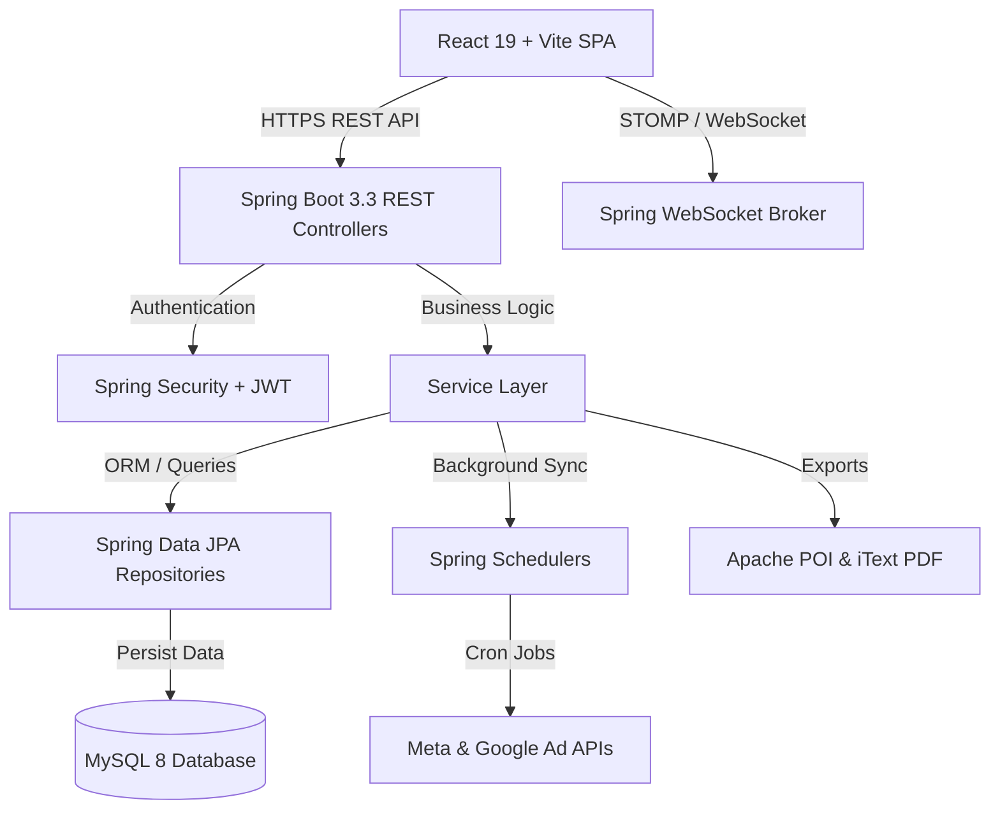

# NYAAR — Enterprise Marketing Analytics & Lead Management SaaS Platform

> **Tagline:** "One Dashboard. Every Lead. Complete Growth."

**NYAAR** is an enterprise-grade SaaS dashboard and Lead Management System (LMS) built for performance marketing teams, digital agencies, and sales operations. The platform centralizes campaign analytics, intelligent lead distribution, real-time activity feeds, executive productivity tracking, and reporting into a unified, high-performance web platform.

---

## Table of Contents

- [Platform Overview](#platform-overview)
- [Key Features & Modules](#key-features--modules)
- [Tech Stack](#tech-stack)
- [System Architecture](#system-architecture)
- [Project Directory Structure](#project-directory-structure)
- [Role-Based Access Control (RBAC) & Seed Accounts](#role-based-access-control-rbac--seed-accounts)
- [Core API Endpoints Index](#core-api-endpoints-index)
- [Getting Started](#getting-started)
  - [Prerequisites](#prerequisites)
  - [Option 1: Docker Compose (Recommended)](#option-1-docker-compose-recommended)
  - [Option 2: Local Development Setup](#option-2-local-development-setup)
- [Configuration & Environment Variables](#configuration--environment-variables)
- [Background Schedulers & Real-time Layer](#background-schedulers--real-time-layer)
- [Troubleshooting & FAQ](#troubleshooting--faq)
- [License](#license)

---

## Platform Overview

NYAAR closes the gap between performance marketing spend and sales conversions. By capturing leads from ad platforms (Meta Ads, Google Ads), automatically assigning them to sales representatives, tracking daily calls/tasks, and providing executive monitoring, NYAAR ensures no revenue opportunity is missed.

### High-Level Workflow
1. **Intake & Sync:** Marketing ad campaigns sync lead and spend data into NYAAR via automated schedulers or webhooks.
2. **Smart Assignment:** Intelligent round-robin or workload-based queues assign incoming leads to sales reps based on availability and priority.
3. **Execution & Engagement:** Sales reps utilize the **MyWork Workspace**, **Priority Center**, **Call History**, and **Interactive Calendar** to manage daily follow-ups.
4. **Monitoring & Analytics:** Managers and Executives monitor real-time SLA compliance, team productivity metrics, and campaign ROI.
5. **Reporting & Audit:** Exportable CSV, Excel, and PDF reports provide stakeholder visibility, backed by full immutable audit logs.

---

## Key Features & Modules

### 1. Unified Executive Workspace ("MyWork")
- **Personalized Rep Command Center:** Consolidates daily call queues, pending follow-up tasks, assigned leads, and calendar events into a single screen.
- **Quick Action Triggers:** Log calls, add notes, reschedule tasks, or advance lead status in one click.

### 2. Smart Lead Management & Queue Distribution
- **Automated Lead Scoring & Triage:** Priority matrix tags hot, warm, and cold leads based on interaction recency and campaign source.
- **Smart Assignment Engine:** Auto-assigns leads using balanced workload or round-robin algorithms.
- **Lead Reclamation & Auto-Reassignment:** Automated background scheduler reclaims uncontacted leads after configured SLA timeouts.

### 3. Executive Work Monitoring & Team Analytics
- **Live Team Operations Dashboard:** Real-time visibility into rep availability, call volumes, conversion rates, and SLA compliance.
- **Productivity Scoring:** Tracks sales activities (calls, emails, meetings, notes) per agent over customizable timeframes.

### 4. Priority Center & SLA Monitoring
- **Overdue Task Alerting:** Highlights leads with breached SLA response times or missed follow-ups.
- **Urgent Lead Triage:** Direct access to unassigned or high-value leads requiring immediate intervention.

### 5. Multi-Channel Campaign & Ad Sync Engine
- **Meta & Google Ads Integration:** Simulated and live API connectors to ingest spend, clicks, impressions, and lead events.
- **Hourly & On-Demand Sync:** Automated sync scheduler backed by manual sync overrides on the Integrations page.

### 6. Interactive Calendar & Reminder System
- **Integrated Scheduling:** Plan demo calls, follow-ups, and customer meetings with full day/week/month grid views.
- **Automated Event Reminders:** `CalendarReminderScheduler` emits real-time WebSocket notifications prior to scheduled events.

### 7. Custom Reporting & Analytics Studio
- **Multi-Format Export Engine:** Generate comprehensive campaign and lead reports in CSV, XLSX (Apache POI), and PDF (iText).
- **Manager & User Analytics:** Visual funnel analysis, lead decay charts, revenue projections, and source performance breakdown.

### 8. System Health & Security Monitoring Center
- **System Metrics Monitoring:** Live tracking of server CPU usage, memory consumption, JVM thread counts, and API response times.
- **Security Command Center:** Active user session monitoring, failed authentication tracking, IP whitelisting, and token management.

### 9. Multi-Tenant Workspace & Member Management
- **Agency Workspaces:** Isolated tenant data boundaries allowing agencies to manage distinct client organizations.
- **Invite Management:** Secure invite code generation (`LEAD-GROWTH-2026`) and email onboarding flow.

---

## Tech Stack

### Frontend Application
- **Framework & Runtime:** React 19.x, TypeScript 5.x, Vite 6.x
- **State Management:** Zustand 5.x (persisted local state), TanStack React Query 5.x
- **Styling & UI:** Tailwind CSS 4.x, Glassmorphism design system, Framer Motion 12.x
- **Data Visualization:** Recharts 3.x
- **Icons:** Lucide React
- **Form Handling & Validation:** React Hook Form 7.x, Zod 4.x
- **Linting & Tooling:** Oxlint, PostCSS 8.x

### Backend API Service
- **Framework:** Java 17, Spring Boot 3.3.1
- **Security:** Spring Security, JWT (JJWT 0.12.5), Password Hashing (BCrypt)
- **Data Access:** Spring Data JPA, Hibernate ORM
- **Database:** MySQL 8.x
- **Realtime / WebSockets:** Spring WebSocket + STOMP messaging broker
- **Reporting Engines:** Apache POI 5.2.5 (Excel/CSV), iText 5.5.13 (PDF)
- **Scheduler:** Spring `@Scheduled` cron execution framework

---

## System Architecture



---

## Project Directory Structure

```text
LeadGrowth/
├── docker-compose.yml              # Container orchestration (Frontend, Backend, MySQL)
├── README.md                       # Project master documentation
├── backend/                        # Java Spring Boot backend project
│   ├── pom.xml                     # Maven dependencies & build configuration
│   └── src/
│       └── main/
│           ├── java/com/leadgrowth/
│           │   ├── config/         # Security, CORS, WebSocket, & JPA configs
│           │   ├── controller/     # 27+ REST controllers handling platform routes
│           │   ├── dto/            # Data transfer objects for requests/responses
│           │   ├── entity/         # 34+ JPA entities (User, Lead, Campaign, Task, etc.)
│           │   ├── exception/      # Global exception handling & custom errors
│           │   ├── repository/     # Spring Data JPA interface repositories
│           │   ├── scheduler/      # Auto-reassignment, Calendar & Sync schedulers
│           │   ├── security/       # JWT filters, UserDetailsService, Token provider
│           │   ├── service/        # Core business logic implementations
│           │   └── websocket/      # STOMP message handlers & push service
│           └── resources/
│               └── application.properties # Spring configuration & environment defaults
└── frontend/                       # React + TypeScript Vite frontend project
    ├── package.json                # Frontend dependencies & scripts
    ├── vite.config.ts              # Vite server & proxy configuration
    └── src/
        ├── components/             # Reusable UI elements, modals, cards, inputs
        ├── hooks/                  # Custom React hooks (auth, websocket, theme)
        ├── layouts/                # Main Dashboard & Auth page layouts
        ├── pages/                  # 28+ Views (Dashboard, MyWork, Leads, Calendar, etc.)
        │   └── dashboards/         # Role-specific dashboard layouts (Admin, Manager, User)
        ├── services/               # Axios API clients & WebSocket connection managers
        ├── store/                  # Zustand stores for auth, workspace, notifications
        └── types/                  # TypeScript interfaces & domain models
```

---

## Role-Based Access Control (RBAC) & Seed Accounts

LeadGrowth implements strict RBAC across 3 primary roles:

| Feature / Area | Admin | Manager | User (Sales Rep) |
|---|:---:|:---:|:---:|
| Full Workspace & Billing Settings | ✅ | ❌ | ❌ |
| Team User Management & Invites | ✅ | ✅ | ❌ |
| Executive Work Monitoring & System Logs | ✅ | ✅ | ❌ |
| Integration Setup & Manual Sync Overrides | ✅ | ✅ | ❌ |
| Custom Report Generation & Exports | ✅ | ✅ | ✅ (Own data) |
| Manage All Assigned Leads & Reassignments | ✅ | ✅ | Assigned only |
| Personal MyWork Workspace & Daily Tasks | ✅ | ✅ | ✅ |

### Default Seed Accounts

Upon first launch, the backend seeds the database with the following demo credentials:

| Role | Email | Default Password | Workspace Invite Code |
|---|---|---|---|
| **Admin** | `admin@leadgrowth.com` | `Admin@123` | `LEAD-GROWTH-2026` |
| **Manager** | `manager@leadgrowth.com` | `Manager@123` | `LEAD-GROWTH-2026` |
| **User (Sales Rep)** | `user@leadgrowth.com` | `User@123` | `LEAD-GROWTH-2026` |

---

## Core API Endpoints Index

Below is a summary of key REST API modules available in the backend:

| Base Route | Description | Key Operations |
|---|---|---|
| `/api/auth` | Authentication & Security | Login, Register, Refresh Token, Password Reset, Email Verification |
| `/api/users` | User Administration | List Users, Update Roles, Deactivate, User Profiles |
| `/api/workspaces` | Multi-Tenant Workspaces | Create Workspace, Invite Team Members, Workspace Settings |
| `/api/leads` | Lead Pipeline Management | Create Lead, Status Transition, Assign Lead, Lead Timeline |
| `/api/lead-queue` | Smart Queue & Triage | Fetch Unassigned Leads, Auto-assign, Claim Lead |
| `/api/tasks` | Task & Activity Tracking | Create Task, Log Call, Reschedule Task, Task History |
| `/api/calendar` | Interactive Calendar | Fetch Events, Create Event, Reschedule Event, Reminders |
| `/api/followups` | Follow-up Reminders | Schedule Followup, Mark Completed, Pending Reminders |
| `/api/campaigns` | Ad Campaign Tracking | List Campaigns, Metric Summaries, Spend vs ROI |
| `/api/integrations` | Meta/Google Integrations | Connect Integration, Trigger Manual Sync, View Sync Logs |
| `/api/reports` | Custom Report Builder | Generate Report, Export to CSV / XLSX / PDF |
| `/api/executive-monitoring` | Sales Executive Monitoring | Rep Availability, Productivity Scores, SLA Compliance |
| `/api/system-monitoring` | Infrastructure Metrics | CPU/Memory Stats, Thread Count, Uptime Monitor |
| `/api/security-center` | Security Command Center | Active Sessions, Failed Logins, Security Policies |

---

## Getting Started

### Prerequisites

- **Docker & Docker Compose** (Recommended for full stack execution)
- **Node.js 18+ & npm 9+** (For local frontend development)
- **JDK 17+ & Maven 3.8+** (For local backend development)
- **MySQL 8.0+** (If running backend locally outside Docker)

---

### Option 1: Docker Compose (Recommended)

Run the entire application stack (Frontend, Backend, and MySQL) with a single command:

```bash
docker-compose up --build
```

**Services Deployed:**
- **Frontend Dashboard:** [http://localhost:3000](http://localhost:3000)
- **Backend Spring Boot API:** [http://localhost:8080](http://localhost:8080)
- **MySQL Database:** `localhost:3306`

To shut down containers and volumes:
```bash
docker-compose down -v
```

---

### Option 2: Local Development Setup

#### 1. Setup MySQL Database
Create the MySQL database manually:
```sql
CREATE DATABASE leadgrowth;
```

#### 2. Configure & Start Backend
Navigate to the backend directory and build with Maven:
```bash
cd backend
mvn clean package -DskipTests
mvn spring-boot:run
```
The backend server will start on [http://localhost:8080](http://localhost:8080) and automatically seed demo data.

#### 3. Start Frontend SPA
In a separate terminal, navigate to the frontend directory:
```bash
cd frontend
npm install
npm run dev
```
The Vite development server will spin up on [http://localhost:5173](http://localhost:5173) (or [http://localhost:3000](http://localhost:3000)).

---

## Configuration & Environment Variables

### Backend Configuration (`backend/src/main/resources/application.properties`)

| Key | Default Value | Description |
|---|---|---|
| `server.port` | `8080` | HTTP port for backend server |
| `spring.datasource.url` | `jdbc:mysql://localhost:3306/leadgrowth` | MySQL connection string |
| `spring.datasource.username` | `root` | MySQL database username |
| `spring.datasource.password` | `password` | MySQL database password |
| `jwt.secret` | `404E635266556A586E3272357538782F413F4428472B4B6250645367566B5970` | Secret key for signing JWT tokens |
| `jwt.expiration` | `86400000` (24 Hours) | JWT access token validity in ms |

### Frontend Configuration (`frontend/.env`)

| Key | Default Value | Description |
|---|---|---|
| `VITE_API_BASE_URL` | `http://localhost:8080/api` | Base URL for REST API requests |
| `VITE_WS_BASE_URL` | `ws://localhost:8080/ws` | WebSocket connection endpoint |

---

## Background Schedulers & Real-time Layer

### Background Schedulers (`com.leadgrowth.scheduler`)
- **`SyncScheduler`**: Executes hourly automated sync jobs with simulated ad networks (Meta/Google Ads).
- **`AutoReassignmentScheduler`**: Periodically checks for leads uncontacted beyond configured SLA windows and reclaims them to the open lead queue.
- **`CalendarReminderScheduler`**: Monitors upcoming calendar events and triggers notifications to attendees prior to event start.

### Real-Time WebSocket Events (`/ws`)
- Broadcasts instant lead assignments, call queue updates, and system alerts to active reps.
- Client subscribes using STOMP topics: `/topic/leads`, `/topic/notifications`, `/user/queue/private`.

---

## Troubleshooting & FAQ

- **Backend Database Connection Refused:**
  - Verify MySQL service is active on port `3306`.
  - Confirm credentials in `application.properties` match your local MySQL installation.
- **WebSocket Disconnections / CORS Errors:**
  - Ensure CORS origin settings in `backend/src/main/java/com/leadgrowth/config/SecurityConfig.java` allow your frontend host origin.
- **JWT Token Expiration:**
  - If API calls return `401 Unauthorized`, log out and re-authenticate using a seed account.

---

## License

This project is licensed for internal enterprise application and demonstration purposes. All rights reserved.
